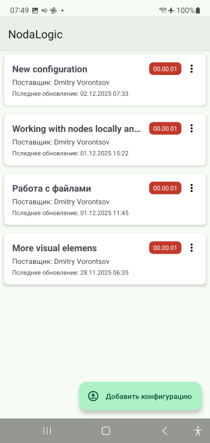

.. NodaLogic documentation master file, created by
   sphinx-quickstart on Wed Nov  5 07:29:33 2025.
   You can adapt this file completely to your liking, but it should at least
   contain the root `toctree` directive.

Platform Architecture
=======================

NodaLogic is a distributed system that can be either centralized with a server and clients—mobile devices and web clients—or decentralized, in the sense that the logic of “nodes”, the main building blocks of the system, can run both on the server and on client devices; there may be many servers, and each client can in turn also be a server.

The foundation of solutions is the “node”. It is an object that is both a data store and has executable methods. It is a self-contained microservice that stores data and is ready to interact with other nodes. Nodes are used to build both the frontend solution and the backend (the frontend/backend boundary is blurred in NodaLogic, because “the server is wherever the node is currently executed”). In a sense, it is like a neuron with inputs/outputs and weights.

A node can represent entities such as a “task”, “document”, “document line”, any other business entity—a warehouse, an item, a bin. And also virtual entities—for example, “item balance in a bin”.

.. image:: _static/node.png
       :scale: 55%
       :align: center

Node data is stored in _data — both working and persistent memory. _data is a JSON-compatible data structure. A node has a reference to a class. The class defines the node’s behavior, its cover, and describes events (the mapping between events and methods).

Data from the UI and handlers goes into _data, and conversely, data stored in _data is displayed in the UI. Essentially, this is a regular JSON-oriented NoSQL.

On the client (a mobile device or web client), user input triggers the onInput/onInputWeb event, and if there is a handler method subscribed to it, it will process this data, save it, possibly call other methods, or send it to other nodes (by calling their methods). In the figure below: the user pressed a button — the onInput event fired, which has a subscription in the form of the Input method (Python) — the Python method (on the mobile device) shows a toast (message) with the variable input1, which contains the input from the input field.

.. image:: _static/event.png
       :scale: 55%
       :align: center

On the server (if a node has server-side methods), a node can be viewed as a microservice. When you create a class, a REST API for the class is created automatically, allowing access both to the class and to its objects (nodes) via HTTP requests. If the node has server-side methods, they can also be executed remotely both from an external system and from mobile clients.

.. image:: _static/api.png
       :scale: 55%
       :align: center

Thus, formally, **a node is _data data + a class (describing the node’s methods and behavior in the system)**. On the one hand, a node is a unit of data, like a record in NoSQL; on the other hand, it is a microservice.

Here is an example of a node class in Python (for the mobile client). You can see that it inherits from Node and has its own methods. The Open method is responsible for rendering, and Input is responsible for handling user input.

.. code-block:: Python

 class MyClass(Node):
    def __init__(self, modules, jNode, modulename, uid, _data):
        super().__init__(modules, jNode, modulename, uid, _data)

    """Class MyClass"""

    def Open(self, input_data=None):
        self.Show(
          [
            [{"type":"Input","id":"input1","caption":"input 1","value":"@input1"}],
            [{"type":"Button","id":"button1","caption":"Get result"}]
          ]
        )

        return True,{}
    def Input(self, input_data=None):
        toast(self._data["input1"])
        
        return True,{}

Currently, 2 types of nodes are available:

 * Regular node (Data node) with the behavior described above
 * Custom process — a node that exists as a single instance, created in the client UI to perform certain user tasks. Unlike a node, it does not need to be created or transferred; it is created when the configuration is loaded.

Classes, in turn, are stored in the configuration — a JSON structure or file. Thus, a configuration is a set of node classes. But not only that: the configuration also defines the overall solution setup — global events, sections, and so on. I.e., the configuration is a JSON repository of node classes, handlers (as a base64-encoded Python file), and general settings. More details about the structure of this file are provided in the “Configuration Structure” section.

On the client, any number of configurations can be loaded simultaneously into the “configuration repository”, and all of them are active at the same time—both for the user and for each other. Classes are typically placed in their own sections and do not interfere with each other. The server follows the same principle: each configuration exists on its own; each class has its own API; each node lives independently.

A node can run on the server, on the client, or on both simultaneously. As a rule, it runs locally—on the machine where it is executed—but it can call a node on the server, as described below.

Here is a scenario of *passive node usage in an offline solution* (as a data object)

 1. Nodes are uploaded to the server via an HTTP request. A class in the server configuration automatically has its own REST API. Through it you can create nodes, request data, and execute methods.
 2. Nodes are delivered to clients via the Rooms mechanism. Devices join rooms via WebSocket and are always ready to receive node changes, similar to how messengers receive messages.
 3. The node on the device works independently offline. No connection to the server is required. UI/UX runs on the client, and data is accumulated.
 4. When needed, data is sent to nodes on the server by calling their methods, or simply by replacing _data in the corresponding node on the server with the _data of the node from the client.
 5. The external system retrieves the data via the same REST API.

The scenario where the server plays its role is almost the same, but has an important difference: the business logic is executed on the server. Let’s break this down using a WMS solution as an example:

 1. The accounting system sends instructions to the NodaLogic server — for example, some document systems: customer orders, supplier delivery notes.
 2. Nodes on the server that act as task generators create task nodes for client devices and register them in a Room; they appear on the device.
 3. On the device, the user performs tasks; the actual execution data is sent to the server immediately (i.e., online mode). The server runs accounting processes, such as calculating item balances, for example.
 4. Upon completion, either the server sends an HTTP request to an external system, or the system queries the task-generator node and pulls the completed tasks (i.e., the factual data). It can also query an accounting node and request, for example, bin balances.

There may also be scenarios *with no server at all*, where a purely mobile solution is created, in which nodes are sent to the server via rooms or even via files. Or data nodes are not used at all and it is simply a mobile solution.
Thus, the system can be simply a mobile client (frontend) builder.

Summarizing everything above, we can say that a node is a self-contained object; a solution is a set of classes; and a system—whether server or client—is a swarm of objects that can interact with each other. The client application is a “player” of nodes, while nodes are delivered to it in a messenger-like mode (or, for example, simply as files via email or other messengers), and are spawned by the user or by other nodes. This is a kind of evolution of the suip file idea in SimpleUI https://uitxt.readthedocs.io/ru/latest/suip.html

