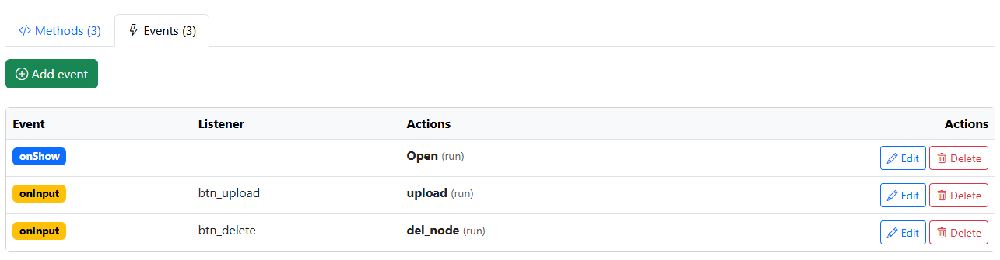
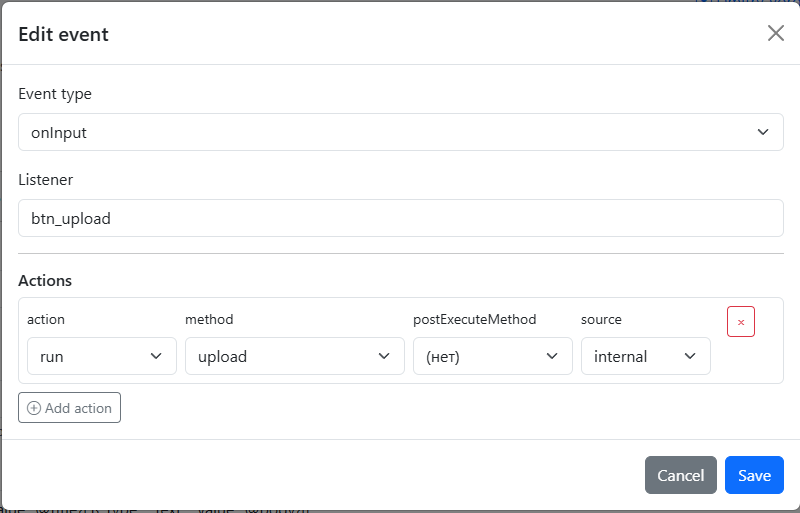

.. NodaLogic documentation master file, created by
   sphinx-quickstart on Wed Nov  5 07:29:33 2025.
   You can adapt this file completely to your liking, but it should at least
   contain the root `toctree` directive.

Classes
==============

A node class is, on one hand, a data storage aspect (a structure where class instances will be stored and have an API for accessing the class and nodes), and on the other hand—it is like a classical OOP class, encapsulating methods and inheriting the methods of its parent (the Node class). A class also describes the behavior of objects—what section they belong to, what events they generate, the UI wrapper, etc. Class properties related to the client are explained in the Mobile Client section.

This section describes working with class methods separately for the client and the server, as well as working with the server through a “remote class.” And, as in standard OOP, there are class methods (creating an object, finding an object, getting all objects, etc.) and methods of the class instance itself (in NL this is called a “node”), inherited from the Node object.

Executing methods and handlers
-----------------------------------
A method can be executed:

 * Locally on the server and the client
 * On the client, you can create a RemoteClass and obtain a “twin” of the server with methods and data. Under the hood there are HTTP requests
 * An external system can execute a method on the server through the REST API
 * An external system can even execute a method on the client through Room by sending a request and then another one to get the result

Local execution on the client
----------------------------------

Events occur on the client (the Events tab). Each event has a type and may also have an additional listener property. For example, there are two buttons with id=button_1 and id=button_2; when pressed, in both cases an onInput event occurs, but with different listeners button_1/button_2. You can assign one handler to the onInput event without specifying the listener—then this handler will run for both buttons, or you can create two separate event handlers with different listeners; in this way the listener acts as a filter.

A single event may have an array of handlers subscribed to it—they will be executed one after another.

The action property determines how the event will be executed in the system—**run** for synchronous execution, **runasync** for asynchronous execution (it makes sense to fill in postExecuteMethod—a callback executed after the asynchronous method finishes), and **runprogress**—essentially the same as runasync but with UI blocking.

It should be noted that in NodaLogic, with python/android handlers, you can generally always use run, and start asynchronous execution and progress bars through client methods, which provides a flexible approach (you can, for example, show a progress bar only on a specific button).

Python is considered the execution engine everywhere.

.. image:: _static/c_methods.png
       :scale: 70%
       :align: center

In the event, we specify the methods that must be defined on the class. This can be done in the configurator, on the Methods tab, or simply in the code of handlers in the body of the class—the system will pull methods from the code. By the way, you can also create classes in code—they will be loaded into the configuration automatically by the constructor.

Here is an example of how a method looks in the constructor (when working with a method from the constructor):

.. code-block:: Python

 self.Show(
  [
    [{"type":"Input","id":"input1","caption":"input 1","value":"@input1"}],
    [{"type":"Button","id":"button1","caption":"Get result"}]
  ]
 )

 return True,{}

And here is how the entire class looks:

.. code-block:: Python

 class MyClass(Node):
    def __init__(self, modules, jNode, modulename, uid, _data):
        super().__init__(modules, jNode, modulename, uid, _data)

    """Class MyClass"""

    def Open(self, input_data=None):
        self.Show(
          [
            [{"type":"Input","id":"input1","caption":"input 1","value":"@input1"}],
            [{"type":"Button","id":"button1","caption":"Get result"}]
          ]
        )

        return True,{}
    def Input(self, input_data=None):
        toast(self._data["input1"])
        
        return True,{}

Inside the method we have parameters:

``self`` – a reference to the class instance. You can call both your own class methods and parent methods (more details here).

A special note should be made about ``self._data`` — the node’s data storage.

The method may also receive ``input_data`` — a dictionary with input data. UI events do not pass anything there, but if you call a method from another method, you can pass data there as a dictionary.

Also, the method result is returned through a tuple ``True/False, output_data``. The first part of the tuple can influence the execution of the event handler array (if False, remaining handlers will not execute), or you may use it at your discretion.

From a handler, you can work not only with the current node, but also with other nodes through the class object and their methods.

Local execution on the server
------------------------------------

There are no events on the server; there are simply nodes, and you can call their methods using the REST command ``POST /node/<class_name> /<node_id>/<method_name>``, which is generated for each class (on the API tab in the class). You can pass parameters (they will appear in the method’s input_data) and get the result.

The class also has other API commands (described in the Synchronization section) that allow you to:

 * create/update a node of the selected class
 * register a node in a selected room for sending to devices
 * get all nodes
 * get access to a specific node for retrieving/updating/deleting

Working with a node on the server through RemoteClass
-----------------------------------------------

Despite the availability of REST API, it is more convenient in python handlers to work through a wrapper in the form of a RemoteClass object.  
Through it you can obtain the class on the server, create/update nodes on the server, and execute their methods.

To work with it, you first obtain a remote class object using GetRemoteClass(class_name, server_url=""), where you must specify the class name and optionally a server alias. The server URL and alias (as well as the default server) should be specified in the Servers section of the configuration… At least one server must exist by default. For example, here we obtain access to a node class on the server:

``Warehouse = GetRemoteClass("Warehouse")``

A remote class (a RemoteClass object) has methods:

 * **get(self, uid)** – returns a remote node by id
 * **create(self, data=None)** – creates a node on the server; you may pass _data for initialization
 * **all(self)** – returns a list of all nodes of the class

Example:

.. code-block:: Python

 # Get remote class
 Warehouse = GetRemoteClass("Warehouse")
 # Get an object
 wh1 = Warehouse.get("4503")
 if wh1:
     toast("Warehouse found")
     # Call method income
     result = wh1.income({"qty": 1})
     message("Method result:"+str(result))
     # Access data
     #message("Quantity:"+ str(wh1._data["qty"]))
     #message("Name:"+str(wh1._data["name"]))

     # Update data
     wh1._data["name"] = "Updated warehouse #1"
     wh1._save()
     toast("Updated name:"+wh1._data["name"])

 # Creating a new object
 new_wh = Warehouse.create({
    "name": "New warehouse",
    "qty": 50,
    "_id":"2"
 })
 message("New warehouse ID:"+ new_wh._data["_id"])

 # Getting all objects
 all_warehouses = Warehouse.all()
 """for wh in all_warehouses:
    print(f"Warehouse {wh['_id']}: {wh['name']} - {wh['qty']} units")"""

A remote node (RemoteObject) has general methods as well as user methods and _data.

 * **_save(self)** – saves the data to disk
 * **_register(self, room_uid)** – registers the node in a room so that other devices receive it through Room

Executing node methods through Room
----------------------------------------

Finally, there is a way for an external system to address a node directly on a device (remember, the device is connected via WebSocket). In this case, via HTTP we communicate with the rooms mechanism and pass a request through WebSocket.

In response to the request, we receive a request_id by which later (when the remote node replies) we can read the execution status and result.

Class and node methods on the client
---------------------------------------

In the solution, user classes inherit from Node and, in addition to their own methods, inherit the class and object methods described in this section.  
Here is an example illustrating how nodes work.

.. code-block:: Python

 class Note(Node):
    def __init__(self, modules, jNode, modulename, uid, _data): #must be added by constructor
        super().__init__(modules, jNode, modulename, uid, _data)
    def MyMethod(self, input_data=None): #user method
        pass

 #...
 class_obj = Note()   #User class object
 new_note = class_obj.create() #New node
 new_note._data["some_variable"]= 1
 new_note.MyMethod({"a":5,"b":2})
 new_note._save() #New node

Client class methods
~~~~~~~~~~~~~~~~~~~~~~~~

 * **create(uid=None, data=None)** – creates a node and returns a node object. You may pass a uid
 * **get(uid)** – get an object by UID
 * **get_all()** – get all nodes of the class
 * **sort( key=None, reverse=False)** – returns objects sorted by key; also helper functions: ``sort_by_field(field_name, reverse=False), sort_by_numeric_field(field_name, reverse=False), ort_by_date_field(field_name, reverse=False, date_format='%Y-%m-%d')``
 * **find(condition)** – searches for objects by a lambda expression like lambda node: node['price'] > 100
 * **count()** – returns the total number of class objects
 * **_upload_all(cls, server_url=None, config_uid=None, condition=None)** – uploads all nodes of the class to the default or specified server
 * **register_all(cls, room_uid, server_url=None, config_uid=None, condition=None)** – registers all nodes of the class in a room for other devices

Client node methods
~~~~~~~~~~~~~~~~~~~~

 * **_save()** – writes the node to disk. You can also enable Autosave in the class, and input from input elements will be saved automatically. Important! With Autosave, if some variables should not be saved, their names must start with "!"
 * **delete()** – deletes the node and all its subordinate nodes
 * **_upload(self, server_alias=None, config_uid=None)** – uploads/updates the node on the server
 * **_delete_from_server(self, server_alias=None, config_uid=None)** – deletes the object on the server
 * **_register(self, room_uid, server_alias=None, config_uid=None)** – registers the object in a room for other devices

 * **AddChild(parent,_class,uid=None,_data=None)** – adds a subordinate node of the selected class. ``new_line = self.AddChild("OrderLine")``
 * **RemoveChild(parent,uid)** – deletes the child and all its descendants recursively
 * **GetChildren(self, level=None)** – retrieves all subordinate nodes and their children. You can select up to which level the slice should be taken.

Helper functions on the client for working with nodes
~~~~~~~~~~~~~~~~~~~~~~~~~~~~~~~~~~~~~~~~~~~~~~~~~~~~~~~~

 * **to_uid(nodes_list)** – converts a list of nodes into a list of UIDs
 * **from_uid(uids_list)** – converts a list of UIDs into a list of nodes

Server class and node methods
-------------------------------

Server class methods
~~~~~~~~~~~~~~~~~~~~~~~~

 * **create(uid=None, data=None)** – creates a node and returns a node object. You may pass uid and an initial _data value
 * **get(uid)** – get an object by UID
 * **get_all()** – get all nodes of the class
 * **sort( key=None, reverse=False)** – returns objects sorted by key; also helper functions: sort_by_field(field_name, reverse=False), sort_by_numeric_field(field_name, reverse=False), ort_by_date_field(field_name, reverse=False, date_format='%Y-%m-%d')
 * **find(condition)** – searches for objects via lambda expressions like lambda node: node['price'] > 100

Node methods
~~~~~~~~~~~~~~

 * **_save()** – writes the node to disk
 * **delete()** – deletes the node and all its subordinate nodes
 
 * **AddChild(parent,_class,uid=None,_data=None)** – adds a subordinate node of the selected class. ``new_line = self.AddChild("OrderLine")``
 * **RemoveChild(parent,uid)** – deletes the descendant and all its descendants recursively
 * **GetChildren(self, level=None)** – retrieves all subordinate nodes and their children. You may choose until which level to slice.

Helper functions on the client for working with nodes
~~~~~~~~~~~~~~~~~~~~~~~~~~~~~~~~~~~~~~~~~~~~~~~~~~~~~~~~

 * **to_uid(nodes_list)** – converts a list of nodes into a list of UIDs
 * **from_uid(uids_list)** – converts a list of UIDs into a list of nodes

Transactions
--------------

Methods shared between client and server that allow organizing accounting in a node (in _data), maintaining a log of protected transactions, and calculating balances by analytics. For example, in the “Finished Goods Warehouse” node you can keep track of items by packaging, and in the “Item” node—track the latest prices.  
The meaning of transactions is that they:

 * **are always cumulative** (transactions are only added)
 * are tightly **linked to the balance** (the balance is always the result of the last transaction, and its balance is the result of the previous one, etc.)
 * **are protected** (transactions form a chain protected by a hash)
 * this approach ensures **maximum performance**—to calculate the balance you do not need to sum over a table; it is enough to take the last transaction and add the new value. To get balances, you simply take the last transactions.

In general, you can build an accounting system purely on nodes (without transactions), but transactions are a mechanism designed specifically for accounting purposes.

There are two types of balances:

 * **Cumulative balances** (based on cumulative transactions). This is when the sum is counted—i.e. the new value is added to the previous one. For example item balance: receipt +5, issue -1. Balance = 4.
 * **Last-value snapshot**, based on state transactions. The new value replaces the previous one. For example price 100, new price 105. Balance = 105.

Transactions and balances are separated by schemes. This is simply a string identifier allowing balance types to be separated. For example, you can simultaneously keep item balances by “item_unit” (scheme _sku_unit) and “item overall” (scheme _sku). A scheme must correspond to transaction keys—an array of keys.

Methods:
 
1. _sum_transaction(self, scheme_name, period=None, keys=None, values=None, meta=None) 

 * scheme_name – scheme identifier
 * period – transaction date/time
 * keys – array of keys
 * values – array of values
 * meta – dictionary of arbitrary data

2. _get_balance(self, scheme_name) – retrieves the cumulative balance

3. _get_sum_transactions(self, scheme_name) – retrieves the array of cumulative transactions

4. _state_transaction, _get_state_balance, _get_state_transactions – completely analogous to cumulative transactions, differing only in the balance calculation principle.

Example

.. code-block:: Python

 WClass = GetRemoteClass("Warehouse") #get the class on the server from the client
 wh = WClass.get(self._data.get("_id"))
 res = wh._sum_transaction(
    "sku_balance", #scheme name
    "2025-09-05", #transaction date
    [self._data.get("sku")], #analytics keys
    [5], #values (item quantity)
    meta={"comment": "Incoming invoice #1"}
 )

 balance = wh._get_balance("sku_balance") #getting balances
