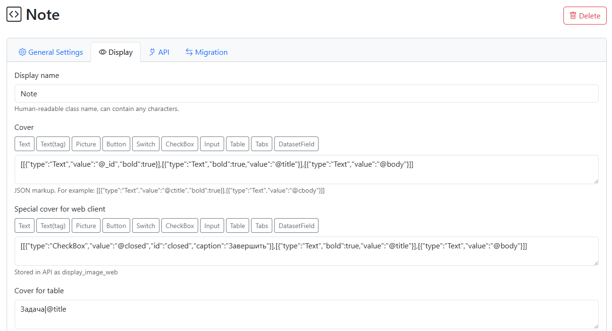
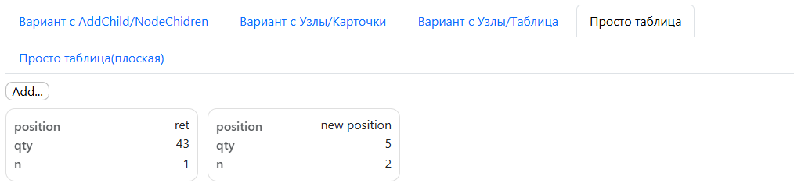

.. NodaLogic documentation master file, created by
   sphinx-quickstart on Wed Nov 5 07:29:33 2025.
   You can adapt this file completely to your liking, but it should at least
   contain the root `toctree` directive.

Client part (mobile and web client)
============================================

All client types adhere to a uniform approach and syntax, but given the different tasks assigned to clients and the different functionality, there are differences between the mobile and web clients.

Features and differences between the web client and the mobile client
---------------------------------------------------------

Nodes can be accessed directly on the server using a web client, which is directly connected to the node database and interacts with the node server directly by storing and executing handler code locally on the server. Nodes can also be accessed via a mobile app on Android. When accessing the Android app (mobile client), nodes are downloaded locally by default, and node handlers are also executed locally on the device. However, if there's a connection, this happens instantly, creating what's called a "pseudo-online" experience. However, if there's no connection, nodes continue to function—they don't require a server. The developer organizes data transfer from the mobile client to the server themselves. Alternatively, this could involve executing a node method on the server and transmitting data to it.

Thus, it can be said that the main difference between a web client and a mobile client is that the web client works only purely online, while the mobile client works mainly locally, regardless of the connection to the server.

Repository
~~~~~~~~~~~~~~~~

.. image::_static/repo_web.png
       :scale: 55%
       :align: center

To start working with a configuration, it must be saved locally to the repository for the client. This also applies to the web client, even though it's purely online.

Both the mobile and web clients work with their own set of configurations—a repository. For the web client, the user can install only those configurations to which they have access. Working with handlers on the server has a unique feature: when a configuration is saved, a configuration handler file is generated, and the client works with it directly (i.e., it doesn't need to retrieve it from the repository each time). The configuration itself is stored in the repository, and the client works with it; if changes occur, it must be updated in the client. This approach allows for debugging handlers.

Working with multiple rooms and registering in rooms
~~~~~~~~~~~~~~~~~~~~~~~~~~~~~~~~~~~~~~~~~~~~~~~~~~~~~~~~~~~

While a mobile client can only be connected to one room, the web client can register changes in multiple rooms (the mobile client can still use the register command for different rooms). For each class, a default room alias can be defined on the Migration tab, and in the "Rooms" configuration section, aliases can be mapped to actual rooms in a specific instance. Then, for each class, changes will be sent to the specific room to which its own group of mobile clients is connected.

.. image::_static/migration.png
       :scale: 55%
       :align: center

On the Migration tab, you can set up registration upon recording - when recording an object in clients, registration will occur in the default room for the class (for the web client) or in the room from the settings (for the mobile client).

You can also enable the "Registration Command" - a "Registration" button will be added to the standard commands block.

Covers for mobile and web clients
~~~~~~~~~~~~~~~~~~~~~~~~~~~~~~~~~~~~~~

Nodes are displayed in sections and node lists, and they require some kind of presentation to the user, including displaying some data. In addition to section lists, nodes can be presented in other elements—lists, selection fields, and so on.

The node in the class has a Cover field, in which you can specify a layout according to the general markup rules (general rules for screens, covers, dialogs, etc.) and it will be applied to all nodes.

But for the web client, you can set a special skin "Special skin for the web client" - according to the same principles, it will just be different from the mobile client.

Also for the web client, you can set a skin for the table view of the client in the list (there is a view switch in the list of nodes) in the format Title|key

Finally, for each node in _data, you can directly specify a specific node's cover using the **_cover** property. This has the highest priority and overrides the previous methods. Using '`_cover``, you can create custom covers for each node, meaning you can play with not only the content but also the form.

Active covers
~~~~~~~~~~~~~~~~~~~~~~~~~~~~~~~~~~~~

.. image::_static/active_cover.png
       :scale: 55%
       :align: center

Covers can display not only data or static markup, but also active elements that generate events (e.g., buttons, checkboxes). The key feature is that these events are routed to the node to which the cover belongs. This means that the events are processed directly in that node, even if it's a list of nodes in another node.

Standard commands
~~~~~~~~~~~~~~~~~~~~~~~~~

You can place "Standard Commands" in clients by checking the "Use Standard Commands" box in the class. You can also create them manually using elements and handlers, but this is easier.

The following become available:

* Save and close
* Save
* Registration (if configured)
* Delete
* Close

Users
~~~~~~~~~~~~~~~~~~~~

For the web client, you can create users and restrict their access in the Users section. By default, a single user has full access. Access control is only available for those with the Configurator access level.

Now available:

* module-level access: web client, API (meaning receiving REST requests), Configurator.  
* Configuration access - allows you to select configurations available to the user. Affects the availability of configuration selection when adding to the Repository, i.e., the configuration selection list.

Will be available (planned):
 
* class-level access
* node-level access (RLS)

Working with a hardware barcode scanner
~~~~~~~~~~~~~~~~~~~~~~~~~~~~~~~~~~~~~~~~~~~~

Different approaches are used to receive onBarcode events on mobile and desktop.

On the mobile client (if using a data collection terminal, TSD), a connection to the barcode driver is established via a subscription to scanner events. In the settings, you must specify the event name, variable, and, optionally, the field length (if the driver downloads data as a byte array rather than a string).

.. image::_static/barcode_web.png
       :scale: 55%
       :align: center

The driver must be launched in the web client on the user's computer, and a connection to the driver must be configured in the browser (the driver sets up a web socket as a server locally on the computer, and the browser acts as its client). The driver runs as a service, resident, and is launched from the command line.

You can compile the program for your OS using pyinstaller by downloading it from GitHub or simply run it under Python after installing the dependencies. Alternatively, you can download the .exe file.

Parameters are specified on the command line. By default, interception is configured in keyboard emulation mode. The host and port can be specified.

Default --keyboard option:

``barcode_scanner_ws --keyboard --host 127.0.0.1 --port 8765``

To connect via COM port:

``barcode_scanner_ws --serial COM3 --baud 9600 --host 127.0.0.1 --port 8765``

Common features of the mobile and web client
------------------------------------------------

General structure of the interface and events
~~~~~~~~~~~~~~~~~~~~~~~~~~~~~~~~~~~~~~~~~~~~~~~

All visual nodes (data nodes and user processes) are located in sections.

.. image::_static/sections.png
       :scale: 55%
       :align: center

Sections are defined in the Sections configuration section using an ID and title. You can also define commands for a section, which will be displayed as buttons at the bottom of the section, as a comma-separated list: <Command Title>|<Command ID>. Clicking a button triggers a general onStartMenuCommand event, which passes the command ID as a parameter.
The node class in turn relates to the section through the Section Code property where you need to select an existing section

All nodes in sections can have a cover, or so-called default cover. The cover is specified as standard markup (see below) in the node class, but can also be specified in _data (the "_cover" property) – thus, nodes of the same class can have different markup. It can also be overridden for a specific node using the SetCover method.

.. image:: _static/cover.png
       :scale: 55%
       :align: center

When you click a node in a section, the node form opens and the onShow event is generated. This event can contain a handler for rendering the screen, otherwise it may be empty. The user may navigate away from this screen and then return (for example, by opening another node in another screen). In such cases, when returning to the screen, the onResume event is generated. This event can contain either the same event as onShow or something special.

Principles of screen layout and other visual forms.
~~~~~~~~~~~~~~~~~~~~~~~~~~~~~~~~~~~~~~~~~~~~~~~~~~~~~

Availability: Mobile client and web client

The system uses two alternative layout approaches that can be combined. The default layout (we'll call this the primary approach) uses a "row-based" layout, i.e., a list of vertical "rows," each row of which is an array of horizontal elements (each element is a visual object of some type). This approach is clearly not exhaustive, but it is sufficient for most business applications. The height and behavior of both rows and elements can be customized. An alternative is container-based layout—vertical, horizontal, and vertical/horizontal scrolling. Both approaches can be combined, or you can simply add a container to the first row and build the entire screen on containers (you can't completely bypass the row-based layout—the layout must still have at least one row).  

For screen layout, node skin, dialog, and list item, a single approach is used in the form of a JSON layout string (in the parameters of Python methods, these are internal list/dict types) of the following type:

.. code-block:: Python

[ #general vertical list from top to bottom
[{"type":…},{"type":…}], #horizontal row of elements
[{"type":…},{"type"":…}], #horizontal row of elements
...
]

Example:

.. code-block:: Python
 
Layout1 =[
[{"type":"Table","id":"l1","value":table_data,"layout":table_layout }],
[{"type":"Button","id":"btn_repl","caption":"@caption"}]
]

Visual elements are arranged in "rows." Each visual element has the following properties:
* **"type"** (string) - element type,
* **"id"** (string) - element identifier. For active elements (those with which the user interacts), an event with a listener property equal to the element's id is typically generated. You can also access the element by id and set its properties.
* **"visible"** (int) – visibility of the element: 1 – visible, 0 – invisible (but takes up space on the screen), -1 – invisible (and does not take up space on the screen)
* **"w"** – element weight. The horizontal/vertical weight of the element (depending on the parent container) relative to other elements. By default, w=1. Example: ``[{"type":"Button","id":"back","caption":"Back"},{"type":"Button","id":"next","caption":"Forward","w":2}] #the next button is twice as wide because it has w=2 (the back button has w=1 by default).`` When combined with height/width, you can control the layout. Depends on the behavior of the parent container. If the container is "sized to fit elements", then the weight is meaningless; it only makes sense if it is "full width" or 0.

* **"width"** – width. Can be specified as either relative numeric dimensions or absolute values: -1 – for the entire container, -2 – for the height of the elements. Depends on the behavior of the root container. If the container has a dimension of "by the width of the elements," then "full width" is meaningless.

* **"height"** – height. Can be specified as either relative numeric dimensions or absolute values: -1 – for the entire container, -2 – for the height of the elements. Depends on the behavior of the root container. If the container has a dimension of "by the width of the elements," then "full width" is meaningless.

* **padding** - internal padding

The default rules are:

* The root vertical list is stretched to fill the entire screen without scrolling.
* All elements in a row have a default height of "element height", and the row itself is stretched in width "to the entire container" (i.e. horizontally from edge to edge of the screen) and has no weight.  
* However, you can change the horizontal row's properties by adding a "Parameters" element with the "w," "width," and "height" properties—that is, set the width and height for the horizontal row (which is the container). This is important if you need more complex markup.
 
For example, in this markup, the bottom row takes up the entire remaining height, due to the fact that it has a weight of 1, then, in the Input element in this row, it makes sense to apply a height of -1 (the entire height)

.. code-block:: Python

[
  [{"type":"Input","id":"title","caption":"Subject","value":"@title"}],
  [{"type":"Parameters","w":1},{"type":"Input","height":-1,"id":"body","caption":"Text","value":"@body","input_type":"multiline"}]
]

The horizontal row itself is a container, but other containers can also be placed within it. In principle, you could completely eliminate the row layout and display only one row with a height that fills the entire screen, and make all the elements within it container elements.

Containers are used both for layout and to group several elements together and manage them together (for example, visibility).

.. warning:: It's extremely important to remember that if you use containers, you must specify a width and height for the elements. The containers themselves usually do the same. Parameters for the "row" element are also possible.

Containers have properties:

* General properties (type, weight, width, height)
* The value property is a list of elements. For Card, this is in the form of general markup in "rows" (an array of arrays) – [[]], and for other containers, it is in the form of an array/list ( [] ) of elements. These are arranged horizontally or vertically, depending on the container type.

There are the following container options:

* **"VerticalLayout"** – vertical non-visual container without scrolling
* **"HorizontalLayout"** – horizontal non-visual container without scrolling
* **"VerticalScroll"** – vertical scrolling. Keep in mind that scrolling "destroys" the element's "full-height" properties.
* **"HorizontalScroll"** – horizontal scrolling
* **"Card"** – the visual container "card" is used for visual design of both list elements and grouping of elements on the screen.

Static and dynamic markup of node form
~~~~~~~~~~~~~~~~~~~~~~~~~~~~~~~~~~~~~~~~~~~~~~~~~~

A node's layout can be specified using the Show command (i.e., by creating a method and hooking it to the onShow event) or overridden by other dynamic methods. This is called dynamic layout. However, sometimes it's more convenient to avoid this and simply specify it in the class card. This is useful if there's only one screen. If a node has any switching screens, they'll still need to be displayed using the Show command. This layout is called static layout, and there are several ways to specify it:

* Specify the node class directly as markup (JSON). Nothing else needs to be done—the node will be rendered using this markup when opened.
* Create a markup element (see the "General Markup" section) and use it in the classroom. You can choose from the available options there.
* In the _data node, place the markup in the _layout key. This option has the highest priority.

Types of visual objects and their unique properties
~~~~~~~~~~~~~~~~~~~~~~~~~~~~~~~~~~~~~~~~~~~~~~~~~~~

Inscription
""""""""""

Availability: Mobile client and web client

Output a text string.

"type": "Text"
 
"value": a string constant or a variable reference prefixed with @. HTML markup can be used (as with all other text).
 
"text_color" – text color in HEX format (example #F54927)

"radius" - background rounding (number)

"stroke" - line outline (number)

"background" - background color in HEX format (example #F54927)
 
"size" – size (integer)

Image
"""""""""""

Availability: Mobile client and web client

.. image::_static/picture.png
       :scale: 55%
       :align: center

Image output

"type": "Picture"

"value" is the absolute path to the file. A constant or a reference to the _data variable with the @ prefix.

Example:

.. code-block:: Python

text_samples = [
[{"type":"Text","value":"@my_text"}], #text from my_text key in _data
[{"type":"Text","value":"Hello <u>world</u>"}] #text constant with html
]

Web client feature: image is only available in base64, this approach will change

HTML field
""""""""""""

Availability: Mobile client and web client

Outputting an HTML document

"type": "HTML"

"value" is a string in HTML format

Button
"""""""""

Availability: Mobile client and web client

Button output. When the screen button is clicked, events with listener=<element id> are generated. For use in lists, see Active List Items.

"type": "Button"

"caption" – the text on the button

"background" – button background color in HEX format

Example:
``{"type":"Button","id":"btn_update","caption":"Simple button"}``

List of bottom buttons
"""""""""""""""""""""""""""

Availability: mobile client

.. image::_static/bottom_buttons.png
       :scale: 55%
       :align: center

Displays a horizontal array of buttons at the bottom of the screen. For in-screen placement only.

"type": "BottomButtons"

"value" is a list of buttons with IDs. The parameters for each button are the same as for Button.

Example:
``{"type":"BottomButtons","id":"bottom","value":[{"type":"Button","id":"back","background":"#F54927" ,"caption":"Back"},{"type":"Button","id":"next","background":"#25a018","caption":"Forward","w":2}]}``

Switch
"""""""""""""""""""

Availability: Mobile client and web client

Switch element. Generates an event and writes the current switch value to a variable (element id).

"type": "Switch"

"caption" – (string) element caption

"value" – the Boolean value of the element to initialize – in the form of a constant or a variable reference. Typically, a reference to the id is placed here.

Example:

``{"type":"Switch","caption":"Setting 1","id":"sw1","value":"@sw1"}``

Check mark
""""""""""

Availability: Mobile client and web client

Switch

Switch element. Generates an event and writes the current switch value to a variable (element id).

"type": "CheckBox"

"caption" – (string) element caption

"value" – the Boolean value of the element to initialize – in the form of a constant or a variable reference. Typically, a reference to the id is placed here.

Example:

``{"type":"CheckBox","caption":"Setting 2","id":"cb1","value":"@cb1"}``

Lists
"""""""""""""

Availability: Mobile client and web client

.. image:: _static/tables.png
       :scale: 55%
       :align: center

Displays various lists of elements. The list can be populated with a list created in the handler, a dataset, or a list of class nodes. Active elements can be placed within elements. For a more attractive presentation, list elements can be packed into a Card. By default, the element layout is auto-generated, but it can be overridden for the entire list or for any element.

"type": "Table"

"value" is a list data source. It can be defined as simply a "list of dictionaries" in Python, making it well-compatible with NoSQL engines like Pelican.

An example of such a definition:

.. code-block:: Python

table_data = [{"name": "element 1", "key":"el1"},{"name": "element 2", "key":"el2"}]
{"type":"Table","id":"l1","value":table_data}

Or (if datasets are used) a link to the dataset can be specified:

``{"type":"Table","id":"l2","value":"goods" }``

Alternatively, if the nodes_source property is used, a list of nodes can be displayed (then a node will be opened when clicked). This can be a search (selection) of nodes or simply a custom list. Nodes are listed as UIDs. You can convert a list of objects to a list of UIDs using the to_uid function.

Example (listing all nodes of the Note class):

``{"type":"Table","id":"t1","nodes_source":True,"value":to_uid(Note.get_all())}``

"layout" – the layout of the list as a whole in the standard "inline" format.

Example:

.. code-block:: Python

table_layout = [
        [{"type":"Text","value":"@_id","bold":True}],
        [{"type":"Text","value":"@name"},{"type":"Text","value":"@barcode"}]
        ]
{"type":"Table","id":"l1","value":table_data, "layout": table_layout }
 
*_layout* on a list item – does the same as layout but for a specific list item. This property is simply added to the data source:

``table_data = [{"name": "element 1", "key":"el1","_layout":layout2},{"name": "element 2", "key":"el2"}]``

*_background* in a list item – colors the background in the specified HEX color

``table_data = [{"name": "element 1", "key":"el1","_background":"#701705" },{"name": "element 2", "key":"el2"}]``
 
"columns_count" – the number of table columns. Displays the list as multiple columns.

"horizontal" – horizontal orientation of the list.

"search_enabled" – enables search mode

Each dataset has its own search settings section, dataset_search, which contains a method (search method), keys (search fields), and min_length (optional), the minimum length from which the search begins.

The method can be:

* text - for regular search by string entry
* levenshtein - for fuzzy search by Levenshtein distance (results will be displayed in descending order of accuracy, with selection >75, the accuracy itself is added to the record in the _confidence field)

Also, pagination is always enabled for the dataset (invisible), but you can configure the page size using the page_size property.

Example:

.. code-block:: Python

dataset_search = {"dataset":"goods","keys":"name","method":"text","min_length":2}
self.Show([
                    [ {"type":"Table","id":"l2","value":"goods" ,"search_enabled":True,"dataset_search":dataset_search}]
        ])

Outputting a list as a table
"""""""""""""""""""""""""""""

Availability: Mobile client and web client

.. image::_static/flat_table.png
       :scale: 70%
       :align: center

In the Table object, you can set the table=true property and use the table_header property with headers in the format ["Title|Key"] or ["Title|Key|Weight"] . The list will then be displayed as a flat table with columns. Otherwise, everything is the same—the same sources are used (in the case of node sources, the fields specified in table_header will be displayed, not the cover image).

Example:

.. code-block:: Python

{"type":"Table","id":"tab4","value":lines,"table":True,
    "table_header":["#|n","Position|position","Qty|qty"]}

List of slave nodes
""""""""""""""""""""""""""

Availability: Mobile client and web client

.. image::_static/children.png
       :scale: 55%
       :align: center

Outputs a hierarchical list of subordinate nodes and their descendants.

"type": "NodeChildren"

No parameters

Bookmarks/Pages
""""""""""""""""""""""""""

Availability: Mobile client and web client

"type": "Tabs"

Groups data by tabs (objects of type: "Tab"). Inside each tab is a container with a standard row expansion.

The general syntax is: {"type":"Tabs","value":[
  {"type":"Tab","id":"tab1","caption":"Base elements","layout":tab1_layout},
  {"type":"Tab","id":"tab12","caption":"List as Table","layout":tab2_layout}
]}

Tabs have one property - ``value`` - a list of Tab bookmarks

Each Tab has:

* id
* caption
* layout - the actual content of the page

Example

.. code-block:: Python

tab1_layout = [
  [{"type":"Spinner","id":"my_spinner","caption":"my select:","value":"@my_spinner", "dataset":spinner_dataset}],
  [{"type":"NodeInput","id":"ni","value":"@ni","caption":"Note","dataset":"Note"}]
]
lines = [
  {"n":1,"position":"Position #1","qty":100},
  {"n":2,"position":"Position #2","qty":120},
  {"n":3,"position":"Position #3","qty":10}
]
tab2_layout = [
  [{"type":"Table","id":"tab4","value":lines,"table":True,
    "table_header":["#|n|1","Position|position|7","Qty|qty|1"]}]
]

self.Show([[{"type":"Tabs","value":[
  {"type":"Tab","id":"tab1","caption":"Base elements","layout":tab1_layout},
  {"type":"Tab","id":"tab12","caption":"List as Table","layout":tab2_layout}
]}]])

Input fields
"""""""""""""

Availability: Mobile client and web client

.. image:: _static/inputs.png
       :scale: 55%
       :align: center

The entire palette of input fields (except dataset fields, which are configured similarly) is of the Input type—regular fields, multi-line fields, drop-down lists, etc. All entered characters are immediately written to the node's _data . If autosave is enabled in the node class, the node is saved immediately.

"type": "Input"

"input_type" is the type of input values ​​(default is just text, input_type can be omitted):
 
* NUMBER – numbers. When written to a variable, numbers are automatically recognized as float/integer depending on the presence of a fractional part.
* PASSWORD – enter your password (closed with asterisks)
* MULTILINE – multi-line text
* DATE – date. When selecting a date, _data receives two values: the date representation (in the variable=id) and _d<element id> – the date in ISO format.

"events" – a flag that enables the generation of events when entering data into the input field

"value" – the default value to display

"caption" field title

"spinner_mode" – the drop-down list mode. In this case, you must specify the value of the source property – a list of values ​​as a string separated by ";"

"autocomplete" - search mode based on the first characters. A source must also be specified.

Drop-down list
""""""""""""""""""""""

.. image:: _static/inputs.png
       :scale: 55%
       :align: center

Availability: Mobile client and web client

"type": "Spinner"

The element allows you to display a dataset as a drop-down list and retrieve the selected value.

The element dataset is specified as a list of dictionaries with required fields:
* _id variant key
* _view representation of the selected value

The remaining fields can be any, they are not displayed but are included in the result

The _id of the selected element is returned to the variable equal to id. The element can also be initialized with this _id.

Example:

.. code-block:: Python

spinner_dataset = [{"_id":"item1","_view":"item 1","some_key1":"some_value1"},
{"_id":"item2","_view":"item 2","some_key1":"some_value2"},
{"_id":"item3","_view":"item 3","some_key1":"some_value3"}]
 
{"type":"Spinner","id":"my_spinner","caption":"my select:","value":"@my_spinner", "dataset":spinner_dataset}

Input field node
""""""""""""""""""""

.. image::_static/node_input.png
       :scale: 55%
       :align: center

Availability: Mobile client and web client

"type": "NodeInput"

"dataset" is the name of the node class. Selecting it will open a selection form with search, sorting, visibility, and skins defined for this class.

The element allows you to select a node as a value in some other node, that is, to specify a reference to the node.

The value is returned/set in the generic node reference format ``<class_name>$<node_id>``

Dataset input fields
""""""""""""""""""""""

Availability: Mobile client and web client

These are used to select a specific dataset value on a form—a directory element or document. They are convenient because they allow you to select an object reference, which can be used to retrieve the entire object or a representation of the object. *In the image in the Input Fields section, the Production dataset field displays the product name and code—this is the specified template.*

The dataset object representation is specified in the Dataset Record Template field. You can also use HTML there.

"type": "DatasetField"

"dataset" – the name of the dataset

"spinner" – selection mode from a list (excludes auto-substitution mode)

"autocomplete" – auto-completion mode.

"caption" – field title

"value" is the default value. It is specified as a reference to the dataset element <dataset name>$<dataset element id>

Inscriptions without an object
"""""""""""""""""""""""""

Availability: Mobile client and web client

In the markup, you can simply specify a string instead of an object with type=Text, then the string will be output, or, if the @ prefix is ​​specified, the value from _data, ``["Hello world"]``

Alternatively, you can use the string construct <title>|<value>, then the string value will also be displayed, but in the form of a kind of Card with the title ``["title|Hello world"]``

Similar constructions can be used for simplification, instead of Text, Card

Active list items (in Table)
~~~~~~~~~~~~~~~~~~~~~~~~~~~~~~~~~~~~~~~

Availability: Mobile client and web client

In the markup of list items, you can use not only text and images, but also some active elements, such as buttons.
When interacting with them, the node receives slightly different (extended) data than when placed on the screen. The developer receives the list name, the name of the active element, the position, and the value (for value input elements).

For example, Button.
Variables for click event (onInput):

listener – comes in the format ``<table id>_input<element id>``

``<table id>_input_position`` - this variable returns the position of the list item where the click occurred

If _data contains a key then the key is also returned:

``<table id>_input_key`` - the key value of the element

For input fields – CheckBox/Switch/Input, the entered value itself is added to the _data variable - ``<table id>_input<element id>``

Active elements available:

* Button
* Input fields
* Check mark
* Switch

Mobile client UI/UX features/techniques
----------------------------------------------

Node methods (on device)
~~~~~~~~~~~~~~~~~~~~~~~~~~~~~~~~~~~~~

Show screen rendering method
""""""""""""""""""""""""""""""""

Availability: Mobile client and web client

**Show(layout)** renders the screen on the node page. This method "clears the canvas" and displays the layout, the principles of which are described in the "Screen Layout" section. At a minimum, it must be written in the onShow handler for anything to appear. It can also be called in other handlers to update the screen with new data and redraw it. Although there is a more efficient UpdateView command for this, sometimes redrawing the entire view is easier.

.. code-block:: Python

self.Show([
  [{"type":"Input","id":"title","caption":"Subject","value":"@title"}],
  [{"type":"Parameters","w":1},{"type":"Input","height":-1,"id":"body","caption":"Text","value":"@body","input_type":"multiline"}]
])

PlugIn screen mechanism connection method
""""""""""""""""""""""""""""""""""""""""""""

Availability: Mobile client and web client (only those listed)

**PlugIn(elements)** connects multiple elements to the screen. These include hardware mechanisms, such as the hardware scanner, and visual elements outside the markup (otherwise they would be displayed in Show). The command parameter is a one-dimensional array of objects (a Python list) with objects of the form {"type":"type_of_element","id":"element_id"}.

.. attention:: The command clears all elements before adding (self.PlugIn([]) - will clear everything), so you need to list all the elements in it at once.

The object types (key type) are as follows:

**CameraBarcodeScannerButton* (mobile only) – an on-screen barcode scanning element. This is an on-screen button that calls the camera for scanning. When scanning, an event with listener=<element ID> is generated, and the barcode will be placed in _data[<element ID>].

Example:

``self.PlugIn([{"type":"CameraBarcodeScannerButton", "id":"barcode_cam"}])``

**BarcodeScanner** – enables barcode interception from a hardware scanner (for data collection terminals). The hardware scanner must be configured in the Settings section under Hardware Scanner Configuration. Subscription to hardware scanner events must be enabled, and the data sent via Intent by your scanner software must be specified. The scanner itself must also be configured to send barcodes via Intent Broadcast rather than, for example, to the keyboard. When scanning, an event with listener=<element ID> is generated, and the barcode will be placed in _data[<element ID>].

FloatingButton (mobile only) – adds a floating button (there can be multiple) to the bottom right of the screen. This element, in addition to an ID (which, like all elements, triggers an event), has a caption field for displaying the button text and fields for customizing the SVG icon (see the "SVG Icons" section for details).

Example:

``self.PlugIn([{"type":"FloatingButton","id":"add_child","caption":"Add <b>line</b>"}])``

**ToolbarButton** (mobile only) – adds a button to the toolbar. This element, in addition to its id (which, like all elements, triggers an event), has a caption field for displaying the button text and fields for customizing the SVG icon (see the "SVG Icons" section for details).

Example:

``self.PlugIn([{"type":"ToolbarButton","id":"pin","caption":"Save","svg":svg2,"svg_size":24,"svg_color":"#FFFFFF"} ]])``

**PhotoButton** (mobile only) – opens the camera to take a photo. The photo is saved to a file; the path to the file is in _data[<element ID>]. If MediaGallery is enabled, the photo is automatically added to the gallery. Automatic addition can be disabled by setting the OFFAutoupdateMediaGallery flag in the node's _data. This will intercept the photo in the handler, allowing for processing before adding it to the gallery.

Example of manual processing

.. code-block:: Python
 
def CaptureImage(self, input_data=None):
        gallery_array = self._data["pic_files"]
        base64 = getBase64FromImageFile(this._data["result_file"],50,50) #doesn't lead to anything, just got a crop in base64
        gallery_array.append(this._data["result_file"])
        toast(self._data["result_file"])
        UpdateMediaGallery(gallery_array)

        return True,{}

**GalleryButton** (mobile, coming to web) – opens the camera to attach a media file from the gallery. The photo is saved to a file; the file path is in _data[<element ID>]. Similar to PhotoButton.

**MediaGallery** (mobile, coming to web) – a gallery of media files at the bottom of the screen with the ability to open and delete them. The element's id key stores an array of file paths displayed in the gallery. By default, PhotoButton and GalleryButton automatically interact with it, but this array can also be edited from a handler (for example, by adding a photo). User deletion is also possible. After deletion, a <variable_name>_delete event is generated, allowing you to retrieve the modified gallery file array, for example.

.. image:: _static/inputs.png
       :scale: 90%
       :align: center

The _open() method for opening a node in the interface
"""""""""""""""""""""""""""""""""""""""""""""""""""""""""

Availability: Mobile client and web client

**_open(method=None)** – opens the node form as if the user had opened it. By default, onShow and the method specified in the configuration are invoked, but this can be overridden in the method parameter.

Method for updating elements on the screen UpdateView
""""""""""""""""""""""""""""""""""""""""""""""""""""""""

Availability: mobile client

**UpdateView(id,element=None)** – a command for selectively updating elements. Recommended for high-load interfaces (e.g., ActiveCV).

Works in several modes:

1. Simply redraws the element by id. This makes sense if the element's value is specified by a variable (using @) rather than a constant. Example: ``self.UpdateView("btn_repl",None)``
2. Changes the properties of an element. Example: ``self.UpdateView("btn_repl",{"background":"#C82909"})``
3. Replaces an element with another element. You can do this with containers, for example. Example: ``self.UpdateView("btn_repl",{"type":"Input","id":"inp1","caption":"New input---"})``

General UI/UX techniques for the client
~~~~~~~~~~~~~~~~~~~~~~~~~~~~~~~~~~~~~~~~~~

**SetTitle(title)** (mobile client) – sets the title of the node window

**RefreshTab()** (mobile client) – refreshes the current tab (section) from which the node is opened. This is useful when a node has been added/changed and returning to the list.

**CloseNode()** (mobile client) – closes the node form

RunGPS/StopGPS (mobile client) – GPS start/stop commands. User permission may be required. GPS reads data from the device at intervals, so the first data will not be available immediately. Accuracy may also fluctuate, so it's best to use a timer when reading GetLocation data.

**GetLocation** (mobile client) – gets GPS data in the format of a serialized JSON object with the following fields:

*altitude* – height
*latitude* – latitude
*longitude* – longitude
*accuracy* – precision, in meters
*provider* – data provider

**ScanBarcode(listener)** (mobile client) – initiates a camera scan, as if the user had pressed the scanner button connected via PlugIn. The event specified in the parameter is returned as a result.

**Dialog(id,title,yes_caption="",no_caption=",layout=None)** (mobile and web client) – a method for displaying both simple dialogs and dialogs with markup. At a minimum, just the title is required; you can also override two buttons and create any layout according to general markup rules.

.. image:: _static/dialog.png
       :scale: 90%
       :align: center

Returns an event with listener=<id>_positive/<id>_negative depending on which button the user clicked. If the dialog has markup and any inputs, the data is written directly to _data.

Examples:

.. code-block:: Python
 
def simple_dialog(self, input_data=None):
        Dialog("dlg1","To be or not to be?","To be","Not to be")
        
        return True,{}
        

def layout_dialog(self, input_data=None):
        Dialog("dlg2","Enter quantity","Ok",None,[[{"type":"Input","id":"qty_dialog","caption":"Quantity","input_type":"number"}]])
        
        return True,{}
        

def input(self, input_data=None):
        if self._data.get("listener") == "dlg1_positive":
          toast("To be")
        elif self._data.get("listener") == "dlg1_negative":
          toast("Not to be")  
        elif self._data.get("listener") == "dlg2_positive":
          toast(str(self._data.get("qty_dialog")))

**AddTimer(key, period)/ StopTimer(key)** – starts/stops the timer with the required key.

Example:

``AddTimer("my_timer",5)``

**ShowProgressButton/ HideProgressButton** – draws a progress bar wheel on the button and makes it inactive until HideProgressButton is executed

Example:

.. code-block:: Python
 
def worker():
    time.sleep(2)
    HideProgressButton("button1")

ShowProgressButton("button1")
t = threading.Thread(target=worker)
t.start()

**ShowProgressGlobal/ HideProgressGlobal** (mobile client) – shows/hides the general (covering the entire screen) progress bar.

**SetCover(node,layout)** – sets a new layout for a node. This is the layout, not the data. If your layout values ​​are specified using @, they will be updated anyway.

**UpdateMediaGallery()** (mobile client) – updates the gallery. Should be executed after any actions on the gallery contents.

Android module functions (mobile client)
~~~~~~~~~~~~~~~~~~~~~~~~~~~~~~~~~~~~~~~~~~~~~~

Interface commands:

* toast(String toast) – display Android message
* message(String text) – display a message
* speak(String text) – speak text (TTS engine)
* listen() – start waiting for speech recognition
* vibrate() and vibrate(int duration) – vibration and vibration of a specified duration
* beep()/beep(int tone)/beep(int tone,int beep_duration,int beep_volume) – sound signal, including the ability to select tone (from 1 to 99), duration and volume (default – 100)
* notification(String message)/ notification(String message,String title)/ notification(String message,String title,int number) – notification in the notification shade. Number – notification identifier, which can be used later to either remove or overwrite (update) it.
* notification_progress(String message,String title,int number,int progress) – notification with a progress bar (from 0 to 100) notification_cancel(int number) – hide notification

Some common properties of elements
-----------------------------------

HTML text in captions
~~~~~~~~~~~~~~~~~~~~~~~~~

Wherever text appears in the interface, you can use HTML tags to mark up the text. For example, Hello <b>world</b>

SVG icons
~~~~~~~~~~~~~~~

.. image:: _static/svg.png
       :scale: 100%
       :align: center

For elements that require icons, you can use SVG icons. Here's how:
 
1. Download and save the SVG file
2. Open the file with a text editor and copy the text into the variable
3. You can use this variable in the svg element property (you can also set the size and color svg_size and svg_color)

.. code-block:: Python
 
svg1 = '<svg xmlns="http://www.w3.org/2000/svg" height="24px" viewBox="0 -960 960 960" width="24px" fill="#1f1f1f"><path d="m720-120 160-160-56-56-64 64v-167h-80v167l-64-64-56 56 160 160ZM560 0v-80h320V0H560ZM240-160q-33 0-56.5-23.5T160-240v-560q0-33 23.5-56.5T240-880h280l240 240v121h-80v-81H480v-200H240v560h240v80H240Zm0-80v-560 560Z"/></svg>'
self.PlugIn([
          {"type":"FloatingButton","id":"add","svg":svg1,"svg_size":48,"svg_color":"#000000"}
    ])

Image and gallery conversion functions
~~~~~~~~~~~~~~~~~~~~~~~~~~~~~~~~~~~~~~~~~~~~~~~~~~

**getBase64FromImageFile(path_to_image)** - returns the base64 string from the file.

**convertImageFilesToBase64Array(paths_to_images_array)** - convenient for converting the "Gallery" into one string: converts an array of paths to an array of base64 strings

**saveBase64ToFile(base64_string)** - saves a base64 string to a temporary file and returns the path to it

**convertBase64ArrayToFilePaths** - saves an array of base64 strings to an array of paths (temporary files) suitable for use in the Gallery.

General client events. Handling application events.
-------------------------------------------------------------------

Some events occur not in nodes, but in the application as a whole, for example, an event when the platform starts, when a barcode is scanned outside of a node, etc. They are processed according to the same principle as node events - that is, they have an assigned event and handler, only not in the node structure, but in the configuration structure on the Common Events tab (in the configuration, this is the CommonEvents section)

Python handlers for such events are therefore not written in node classes, but simply as functions in the handler code. Some events also contain data, which is passed to the corresponding key in input_data.

Example:

.. code-block:: Python
 
def onBarcode(input_data):    
    toast(input_data.get("barcode"))    
    return True,{}

They must have an input_data parameter of type dictionary.

List of common event types (mobile client):

* **onLaunch** – event when loading the configuration (or when restarting). Without parameters.
* **onTimer** – timer event. In input_data, the “timer_key” key is the key of the triggered timer.
* **onJSONFile** – the event of opening a JSON file by an application (via Open or Share). In input_data, the "content" key is the file contents as a string.
* **onTextFile** – the event of opening a text file by an application (via Open or Share). In input_data, the "content" key is the file contents as a string.
* **onBarcode** – event of a barcode scanned via ScanBarcode, i.e. outside the node, from the main menu
* **onStartMenuCommand** – clicking on a command in the configuration section (those commands that are added through Configuration Sections)
* **onDialogResult** – event for a dialog called from the main menu. Since the dialog is called with a specific identifier, either result_positive or result_negative is returned in the result key, and the data from the dialog's input elements, if any, is returned in the result_data key.

List of common event types (web client):

* **onBarcode** – event of a barcode scanned via ScanBarcode, i.e. outside the node, from the main menu
* **onStartMenuCommand** – clicking on a command in the configuration section (those commands that are added through Configuration Sections)
* **onDialogResult** – event for a dialog called from the main menu. Since the dialog is called with a specific identifier, either result_positive or result_negative is returned in the result key, and the data from the dialog's input elements, if any, is returned in the result_data key.

Search, sort, and visibility of nodes (client)
--------------------------------------------------

The NodaLogic mobile client has built-in mechanisms for searching, sorting, and hiding nodes that run on the client side and do not require additional code or APIs.

These mechanisms are controlled through special service fields in the node's _data.

Search by nodes
~~~~~~~~~~~~~~~~

Default behavior

If a node does not specify a specific search field, the application searches:

by all keys of the _data dictionary

the search is performed by the string representation of the values

The _search_index field

To control the search explicitly and improve performance, it is recommended to use the field:

``_search_index``

If it is set:

* search is performed only by this field

* search becomes faster and more controlled

Example

.. code-block:: Python
 
self._data["_search_index"] = (
    self._data.get("number", "") + " " +
    self._data.get("customer_name", "")
)

``_search_index`` must be a regular string

Sorting nodes
~~~~~~~~~~~~~~~~~~

Sorting of node lists is also performed on the client side.

For this purpose, special fields are used:

``_sort_string`` — sort in ascending order

``_sort_string_desc`` — sort in descending order

Sorting example

Sort by date (ascending):

``self._data["_sort_string"] = self._data.get("plan_date")``

Sort by date (descending):

``self._data["_sort_string_desc"] = self._data.get("created_at")``

Hiding nodes
~~~~~~~~~~~~~~~~~~

A node can be hidden from the interface without physically deleting it.

The field is used for this:

_hidden

If set to True:

the node is not displayed in the lists

the node remains accessible through code and API

Example of hiding a node

``self._data["_hidden"] = True``

