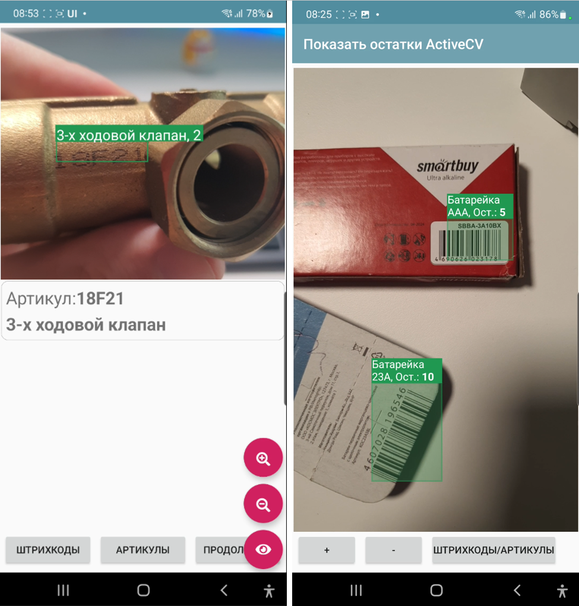
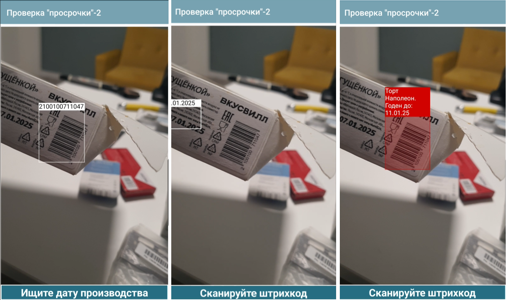

.. NodaLogic documentation master file, created by
sphinx-quickstart on Wed Nov 5 07:29:33 2025.
You can adapt this file completely to your liking, but it should at least
contain the root `toctree` directive.

ActiveCV Computer Vision and Augmented Reality
========================================================

:scale: 75%
:align: center

ActiveCV is a business process automation technology that overlays essential process data directly onto the video feed rather than displaying it on a standard screen. It utilizes various detectors—such as those for barcodes, OCR, and facial recognition—in conjunction with the camera. The system enables continuous operator workflow without the need to switch between different views or interfaces. For example, an operator can launch ActiveCV, scan a room code, and—without pausing or pressing extra buttons—proceed to scan equipment inventory codes and VINs, followed by taking a series of photos of the equipment, all while remaining in the augmented view rather than switching to standard button-based screens. They can then move on to the next objects.

A key feature of the technology is object highlighting using different colors—color coding. Examples of color coding include:

* object is in the correct location — green; object is in the wrong location — red. 
* object has been inventoried — green; object has not been inventoried — yellow. * Order past deadline: red; deadline approaching: yellow; on track: green

:scale: 75%
:align: center

Examples demonstrating the technology (viewing the videos or GIFs is recommended) can be found in these articles (the platform has featured two generations of ActiveCV: the first, as a standalone process, is obsolete; the second, as a screen element, is the current version):

* https://habr.com/ru/articles/874560/

Overview of operational mechanisms.
-----------------------------

Placing the visual element.
~~~~~~~~~~~~~~~~~~~~~~~~~~~~~~~~~

The camera (preview) window itself can be placed on the screen. Its placement does not differ from that of other layout elements and shares the same properties: width, height, and weight. The visual element itself is named ActiveCV. It can occupy a portion of the screen or the entire screen. Additionally, the `RunCV` command allows you to launch full-screen mode in a separate window, avoiding the need to embed it directly in the layout.

Resolution
~~~~~~~~~~~~

You can specify the resolution for the detector (**CameraSetResolutionAnalysis**) and for the captured image (**CameraSetResolutionImage**). The preview resolution remains unchanged, as it adjusts automatically. Additionally, the specified resolution might not be supported (especially for the detector); in such cases, the maximum possible resolution will be applied.

Supported resolutions: ``"4K"(4096*2160)``, ``"2K"(2048*1080)``, ``"1080"(1920*1080)``, ``"720"(1280*720)``, ``"640"(640*480)``, ``"360"(360*240)``, ``"200"(200*200)``, ``"100"(100*100)``

Consequently, the lower the resolution (especially for the detector), the faster and smoother the visual component operates.

Detector operation cycle: General overview
~~~~~~~~~~~~~~~~~~~~~~~~~~~~~~~~~

A detector is enabled or switched using the **CameraSetDetector** command, where the detector type(s) are specified as a parameter. Currently available types are ``BARCODE``, ``OCR``, ``FACE``, and ``PHOTO``.

To combine multiple types, separate them with an underscore (e.g., ``BARCODE_PHOTO``, ``BARCODE_OCR``).

When a new, unrecognized object appears in the frame, the **new_text_detected** or **new_barcodes_detected** event (listener) is triggered, depending on the detector type. A JSON array of frame objects—**detected_values**—is available in the _data field. The content of the recognized elements depends on the specific detector. Within the event handler, you can customize the visual appearance of the recognized objects.

Object display
~~~~~~~~~~~~~~~~~~~~~~~~

You can override the captions for recognized objects and specify the color of the bounding box displayed over them. This configuration is stored in a single list, **SetObjectsView**, as a JSON array of objects containing the fields `id`, `color` (HEX format), and `caption`. The `id` corresponds to the barcode or text value.
On slower devices, the display is simplified. HTML formatting is available for object captions via the **CameraSetPrettyView** command. For instance, you can set the caption to something like `"Item X, <b> stock: Y </b>"`. Additionally, in "Pretty View" mode, caption sections are sized according to the object rather than the text, meaning line wrapping occurs. To enable this display style, you must use the **CameraSetPrettyView** command in addition to **SetObjectsView**.

Manual management of the detected object list.
~~~~~~~~~~~~~~~~~~~~~~~~~~~~~~~~~~~~~~~~~~~~~~~~~~~~~~

By default, the **new_..._detected** handler (e.g., **new_barcodes_detected**, **new_text_detected**) is triggered for new objects; once this happens, they are no longer considered "new," and the events are not fired for them again. However, you can manage this manually using the **CameraSetOCRDetectedListManual** flag (with an empty parameter), followed by manual registration via **CameraOCRAddDetected** (passing a list of IDs as the parameter). The **CameraClearDetected** command (with an empty parameter) is also available to simply clear the list of all detected objects.

Validators
~~~~~~~~~~~~~

A validator can be enabled so that, during scanning, a lookup is performed against node or dataset indices; this ensures that the `new_text_detected` or `new_barcodes_detected` handler receives only objects present in the database—i.e., known objects—rather than all objects (such as those filtered by mask, format, or other preprocessing steps). This is done primarily to improve performance. Functionally, receiving the values ​​in the handler and processing them there yields the same result, though it is slightly less efficient. However, this approach is not always applicable; sometimes, it is necessary to evaluate various possibilities directly within the handler. Example of a barcode validator based on node index:

.. code-block:: Python

 self._data["CameraSetBarcodeValidator"] = {
  "node_index": {
  "class": "Goods", 
  "name": "barcode"
 }
 }

It can also be specified via a global index:

.. code-block:: Python

 {
  "global_index": "goods_barcode"
 }

Or via dataset index:

.. code-block:: Python

 {
 "dataset": "goods",
 "keys": ["barcode"]
 }

For OCR:

.. code-block:: Python

 self._data["CameraSetOCRValidator"] = {
 "node_index": {
 "class": "Goods",
 "name": "name"
 },
 "min_chars": 3,
 "max_chars": 40
 }

Switching between front and rear cameras
~~~~~~~~~~~~~~~~~~~~~~~~~~~~~~~~~~~~~~~~

**CameraSetSelector**,<mode> - if mode="front", the front camera is used; if "back", the standard (rear) camera is used.

Setting a frame
~~~~~~~~~~~~~~~~~~~~~~

A frame can be displayed on the screen; values ​​will then be read only from within that frame, ignoring the area outside it.

**CameraSetFrame**,<parameter_string> - sets the frame as a percentage of the ActiveCV element size, in the format <percent_x1>_<percent_y1>_<percent_x2>_<percent_y2>

Example:

.. code-block:: Python

 self._data["CameraSetFrame"] = "20_45_80_55"

Zoom
~~~~~

**CameraSetZoom**, <parameter> – the desired zoom level (the variable stack uses strings, so numbers and other parameters are passed as strings).

Stopping the video stream.
~~~~~~~~~~~~~~~~~~~~~~~~

**CameraStopDetectorOnNewObjects** - enables a mode where the camera preview automatically pauses upon detecting an object.

An alternative is to use the **CameraStop** command within the handler code.

Resumption occurs upon screen refresh. Flashlight
~~~~~~~~~

**CameraTorchTurnOn** – turns on the camera light (if hardware support is available)

Launching in a separate screen and returning a value
~~~~~~~~~~~~~~~~~~~~~~~~~~~~~~~~~~~~~~~~~~~~~~~~~

**RunCV, <listener>** – launches the ActiveCV screen in full-screen mode until the first result is read; it then closes the camera and generates an event using the name specified in the parameter. This feature is intended for situations where you need to scan something quickly but do not want to—or cannot (due to a small screen)—place an ActiveCV element directly on the screen.
In this scenario, you must specify all the same options in the calling screen's `onStart` method as you would for a standard camera object (e.g., `CameraSetResolutionAnalysis`, `CameraSetDetector`, etc.). The `detected_values` are returned to the parameter (listener) specified in the command, and result processing works similarly, with the sole difference that `SetObjectsView` features—such as object highlighting and labels—are not applicable here.
In the example provided in this article (the version for mobile data terminals/handheld computers): https://infostart.ru/1c/tools/2364633/, I use this specifically for OCR recognition using the new ActiveCV2 engine. Mobile data terminals have their own built-in scanners, so a camera-based barcode scanner isn't needed; however, OCR *is* required, yet there is no space to place an ActiveCV element on the screen (due to the small display size).

Barcode detector specifics (BARCODE)
~~~~~~~~~~~~~~~~~~~~~~~~~~~~~~~~~~~~~~~~~~~~~~~~~~~~~~

**CameraSetSupportedBarcodes** defines a list of supported barcode types, separated by underscores. For example: ``self._data["CameraSetSupportedBarcodes"] ="QR_EAN13"``

If this is not specified, or if "ALL" is set, the system scans for all barcode types. List of available formats: ``QR``, ``EAN13``, ``AZTEC``, ``CODABAR``, ``CODE_93``, ``CODE_39``, ``CODE_128``, ``DATA_MATRIX``, ``EAN_8``, ``ITF``, ``UPC_A``, ``UPC_E``

**CameraSetCurrentBarcodeDetector** specifies the list of current barcode formats for dynamic switching. The format is similar to that of CameraSetSupportedBarcodes. However,
CameraSetSupportedBarcodes defines the formats the camera is capable of reading in general—serving, so to speak, to speed up operation and filter out potential errors—whereas CameraSetCurrentBarcodeDetector is used to switch between formats during runtime.

The array of barcodes in **detected_values** contains objects with the following fields: **value** – the raw barcode (including special characters, if present), **display_value** – the display value, and **format** – the barcode format. Additionally, if a validator is used, the **result** field contains the actual dataset record.

Face Detector (FACE) Specifics
~~~~~~~~~~~~~~~~~~~~~~~~~~~~~~~~~~~~

When detecting faces, results are returned via the new_faces_detected event in the detected_values ​​variable as an array of objects with the keys id (object number) and value (Base64-encoded face image).

.. code-block:: Python

 values = self._data.get("detected_values")
 faces_list = []
 for value_item in values:
  	 faces_list.append({"_id":value_item["id"],"picture":value_item["value"]})

OCR (Text Recognition) Features
~~~~~~~~~~~~~~~~~~~~~~~~~~~~~~~~~~~~~~~~~

The text block processing cycle consists of several stages. All of them execute very quickly as they are handled by the platform. Therefore, I strongly recommend against passing raw text—processed only by weak filters—directly to the handlers; doing so would be far less efficient than using masks, validators, and preprocessing steps.

.. note:: Important! OCR works **only** if a mask is defined. It will not run without a mask! While you could certainly specify a very broad mask, it is better to use one tailored to the specific requirements of the task.

Example of launching OCR in a separate window in NodaScript (the process is similar in Python):

.. code-block:: JavaScript

 _data.CameraSetDetector="OCR"; 
 _data.CameraSetOCRMask=["([a-zA-Z0-9-.]{3,15})"]; 
 RunCV("my_cv")

Text Processing in ActiveCV
~~~~~~~~~~~~~~~~~~~~~~~~~~~~~~~

To summarize: text undergoes preprocessing, followed by the application of Regex masks, and potentially further preprocessing procedures (some settings apply before the masks, others after). Finally, the text is either passed to a validator or sent to the `new_text_detected` handler in its current state. For instance, if the task is to extract all dates from the frame, a validator is unnecessary; however, if the goal is to verify inventory numbers, a validator should be used.

The **CameraSetOCRFormatOptions** command specifies the text preprocessing options. It can include multiple actions separated by underscores:

* CLEARSPACES – removes various whitespace characters
* LOWER – converts to lowercase
* UPPER – converts to uppercase
* TOZERO – converts the letter 'O' to the digit '0'

And a set of options executed after the Regex selection:

* DATE, INT, FLOAT – native text validation for the corresponding data type

The **CameraSetOCRMask** command defines a JSON array of mask strings. Each mask is a Regex expression. For example, "([a-zA-Z0-9-.]{5,10})" is a mask for finding substrings containing Latin characters and digits with a total length of 5 to 10 characters. It is convenient to test masks using regex editors, such as https://regex101.com/. Each mask is applied sequentially; the mask appearing earlier in the array takes precedence.

**CameraOCRListOnly** – a flag ensuring that output is not limited to just the text resulting from validation (if applicable). The **detected_values** field in OCR contains the following:

* value - the text after all transformations
* confidence - the detection confidence level
* result - the validator record

Examples of the `new_<barcodes|text>_detected` handler + `SetObjectsView`:

.. code-block:: Python

 values ​​= self._data.get("detected_values", []) # Get objects in the frame
 objects = self._data.get("SetObjectsView", []) # Coloring array

 if values:
  barcode = values[0].get("value", "")
  self._data["last_barcode"] = barcode
  beep()

 # Update only the text field; do not touch ActiveCV or redraw the screen
 self.UpdateView("last_barcode", None)
 # Search for the object by index
 res = getByIndex("SKU", "barcode", barcode)

 # CameraSetObjectView(barcode, "#f0e224", name) # Can be changed individually like this. Below is a more general method

 name = "Not found"
 if res is not None:
  name = res._data.get("name", "")

 cv = {
 "id": barcode,
 "color": "#f0e224",
 "caption": name
 }

 item = next((x for x in objects if x.get("id") == barcode), None)

 if item is None:
  objects.append(cv)
 else:
  item["color"] = cv["color"]
  item["caption"] = cv["caption"]

 CameraSetObjectsView(objects)

Commands (Python/NodaScript)
~~~~~~~~~~~~~~~~~~~~~~~~~~~~~~

Some ActiveCV options are set when the object is initially placed; however, managing options via `_data` during runtime is inconvenient because it requires redrawing the object—a resource-intensive process that takes about 1–2 seconds to complete. Therefore, certain functions have been implemented as commands that modify the object without requiring a redraw. For instance, `SetObjectView` allows you to change the color of objects in the frame on the fly. **CameraSetObjectView(<object_id>, <HEX_color>, <caption_text>)** – recolors a specific object or sets its caption. ``CameraSetObjectView(barcode, "#f0e224", "my caption")``

**CameraSetObjectsView(objects)** – replaces the current coloring/caption array with a new one (for all objects). Functions similarly to the CameraSetObjectsView key but operates dynamically.

**CameraSetZoom** – dynamically changes the zoom level. ``CameraSetZoom(0.5)``

**CameraStop** – stops the camera.

**CameraSetSupportedBarcodes** – dynamically updates the list of supported barcodes.

**CameraSetSelector** – dynamically switches the camera.
