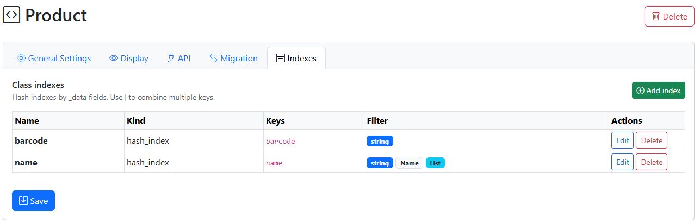
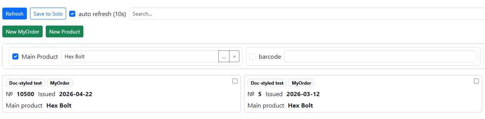

Indexes and Filters in Nodes
===============================

Since NL storage is practically NoSQL, without a fixed field structure, this imposes certain peculiarities on filters and filters. Specifically, they must be provided separately by creating indexes. This means that filters operate on indexes specified in the configuration—both user-defined mechanisms and programmatic methods. Tasks such as searching by the key(s) of one or more nodes also apply to indexes.

Index Configuration
--------------------

:scale: 90%
:align: center

Configuration is performed through the class, Indexes tab

The following are specified:

* **Name** is the name that will be used in functions
* **Index Type** (*Currently, only a hash index is available – i.e., an exact match index)
* **Keys** – this can be a single field or a composite index of several fields separated by the | separator

Filtering in the node list (*web version only)
~~~~~~~~~~~~~~~~~~~~~~~~~~~~~~~~~~~~~~~~~~~~~~~~~~~~~~~~~~~

:scale: 90%
:align: center

You can also define custom filters (filters) in the node list.

To do this, define:

* **Header** - the displayed name of the field (as it will appear in the node list)
* **Filter value type** - in addition to basic fields (string, number, Boolean), Node and Dataset fields are also available. For example, ``Node(Product)`` – filter by fields of the "Product" type
* **List available** – you can specify multiple values ​​in the filter as a list

Functions for working with indexes (for Python and NodaScript)
-----------------------------------------------------------

*Python functions return node objects, NodaScript returns the _id (as a string). To get the _data of a node, use the ``getData(_id)`` function

**getByIndex(class_or_name, index_name, value)** – get a single value by index (or the first one)

NodaScript Example

.. code-block:: JavaScript

sku_id = getByIndex("Product","barcode",_data.cam_barcode); //one value result
if sku_id!=null {
message(getData(sku_id).name); //getData return _data of node by _id
}

Python Example

.. code-block:: Python

res = getByIndex("Product","barcode","4690216127392")
toast(str(res._data["name"]))

**findByIndex(class_or_name, index_name, value)** – get a list of _ids by condition (suitable for use with from_uid functions)

Global Indexes
--------------------------

Indices can be used for any node, including those without a class. If key fields in _data are defined with the __ prefix, for example, __barcode , then this field is automatically considered a hash index and is indexed. It no longer has a class (nor any configuration), and the methods for working with it are:

**findByGlobalIndex(index: str, value)** – search by field, returns a list of _id's

**getByGlobalIndex(index: str, value)** – search by value, returns a single node (_id)
