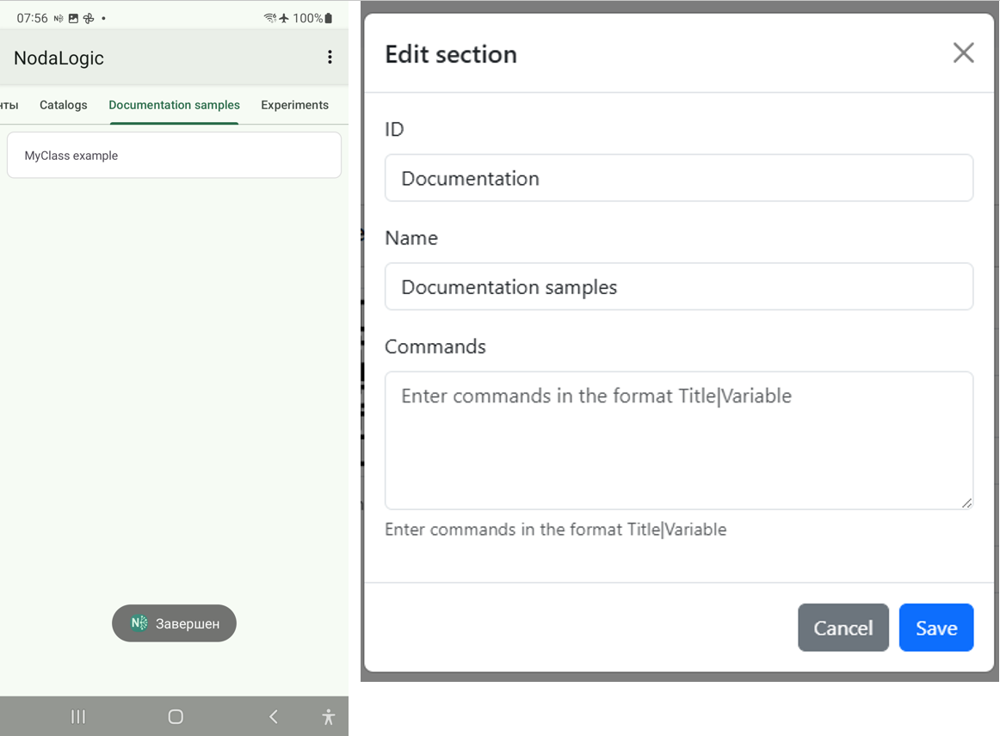
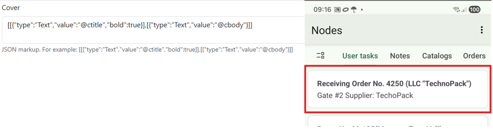
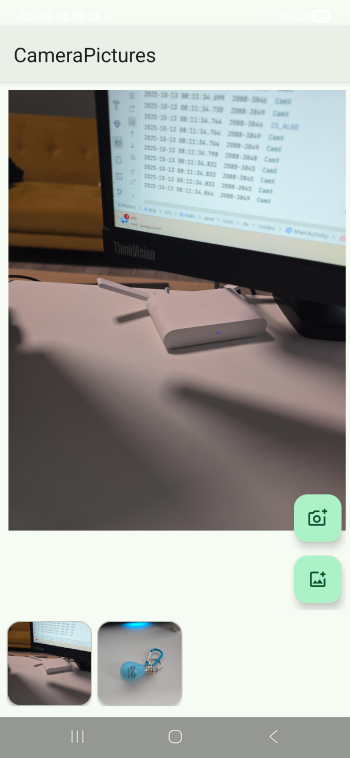
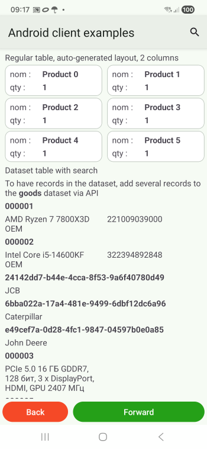
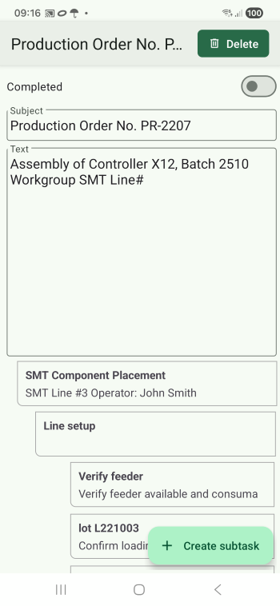
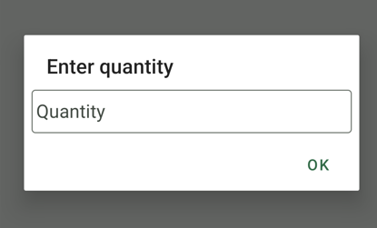
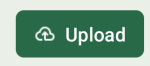

.. NodaLogic documentation master file, created by
   sphinx-quickstart on Wed Nov  5 07:29:33 2025.
   You can adapt this file completely to your liking, but it should at least
   contain the root `toctree` directive.

Мобильный клиент (Android)
=============================

Функции интерфейса
----------------------

Общее устройство интерфейса и событий
~~~~~~~~~~~~~~~~~~~~~~~~~~~~~~~~~~~~~~~~~~~

Все визуальные узлы (узлы данных и пользовательские процессы) располагаются в разделах. 

Разделы задаются в секции конфигурации Разделы в виде ИД и заголовка. Также для раздела можно прописать команды, которые будут показаны в виде кнопок снизу раздела в виде списка через запятую <Заголовок команды>|<ид команды>. При нажатии на кнопку генерируется общее событие onStartMenuCommand в котором в качестве параметра передается ИД команды
Класс узла в свою очередь относится к разделу через свойство Код раздела где нужно выбрать существующий раздел

Все узлы в разделах могут иметь обложку или так называемую обложку по умолчанию. Обложка задается в виде стандартной разметки (см. далее) в классе узла, но также может быть задана в _data (свойство "_cover") – таким образом узлы одного класса могут иметь разную разметку. И также может переопределяться для конкретного узла методом SetCover

При нажатии на узел в разделе открывается форма узла и генерируется событие onShow в котором можно прописать обработчик для отрисовки экрана, иначе он может оказаться пустым. С этого экрана пользователь может уйти, а потом вернуться (например открыв другой узел в другом экране), поэтому в таких случаях, в случае возврата на экран генерируется событие onResume в котором можно прописать тоже самое что и в onShow либо что то особенное.

Принципы разметки экрана и других визуальных форм. 
~~~~~~~~~~~~~~~~~~~~~~~~~~~~~~~~~~~~~~~~~~~~~~~~~~~~~

В системе используется 2 альтернативных подхода к разметке, которые можно комбинировать. По умолчанию (будем называть это основной подход) используется принцип разметки «по строкам» т.е. список вертикальных «строк», каждая строка которого – это массив элементов в горизонтали (каждый элемент – визуальный объект какого то типа type). Понятно, что такой подход не исчерпывающий, но для большинства бизнес-приложений его хватает. Высоту и поведение как строк и элементов при желании можно настроить. Альтернативой этому можно считать разметку контейнерами – вертикальными, горизонтальными и вертикальными/горизонтальными скроллами. Причем оба подхода можно смешивать, а можно например просто в 1ю строку добавить контейнер и весь экран выстроить на контейнерах (полностью перешагнуть через разметку строками не удастся – разметка все равно должна иметь хотя бы 1 строку).  

Для разметки экрана, обложки узла, диалога, элемента списка применяется единый подход в виде строки JSON-макета (в параметрах python-методов это внутренние типы list/dict) такого вида:

.. code-block:: Python

 [ #общий вертикальный список сверху-вниз
 [{"type":…},{"type":…}], #горизонтальная строка  элементов
 [{"type":…},{"type"":…}], #горизонтальная строка  элементов
 ...
 ]

Пример:

.. code-block:: Python
 
 Layout1 =[ 
 [{"type":"Table","id":"l1","value":table_data,"layout":table_layout }], 
 [{"type":"Button","id":"btn_repl","caption":"@caption"}]
 ]

В «строках» располагаются визуальные элементы. Каждый визуальный элемент имеет свойства:
 * **"type"** (string)- тип элемента, 
 * **"id"** (string)- идентификатор элемента. Для активных элементов (с которыми взаимодействует пользователь) как правило генерируется событие со свойством listener, равным id элемента. Также по id можно обратиться к элементу и задать его свойства
 * **"visible"** (int) – видимость элемента: 1 – видим, 0- невидим (но занимает место на экране), -1- невидим (и не занимает место на экране)
 * **"w"** – вес элемента. Вес элемента по горизонтали/вертикали (в зависимости от родителя-контейнера) относительно других элементов. По умолчанию w=1. Пример:  ``[{"type":"Button","id":"back","caption":"Back"},{"type":"Button","id":"next","caption":"Forward","w":2}] #кнопка next в два раза шире, потому что у нее w=2 (у back w=1 по умолчанию).`` В сочетании с высотой/шириной можно управлять разметкой. Зависит от поведения родительского контейнера. Если контейнер «по размеру элементов» то вес не имеет смысла, имеет смысл толкьо если «на всю ширину» или 0.

 * **"width"** – ширина. Может задаваться как в относительных числовых размерах, так и в виде абсолютных значений: -1 – на весь контейнер, -2 – по высоте элементов. Зависит от поведения корневого контейнера. Если контейнер имеет измерение «по ширине элементов», то «на всю ширину» не имеет смысла

 * **"height"** – высота. Может задаваться как в относительных числовых размерах, так и в виде абсолютных значений: -1 – на весь контейнер, -2 – по высоте элементов. Зависит от поведения корневого контейнера. Если контейнер имеет измерение «по ширине элементов», то «на всю ширину» не имеет смысла

Правила по умолчанию такие:

 * Корневой вертикальный список растянут на весь экран без прокрутки. 
 * Все элементы в строке по умолчанию имеют высоту «по высоте элементов», а сама строка растянута по ширине «на весь контейнер» (т.е. по горизонтали от края до края экрана) и не имеет веса.  
 * Но можно поменять свойство горизонтальной строки с помощью добавления элемента "Parameters" с свойствами 	"w","width" и "height" – т.е. установить для горизонтальной строки (она является контейнером) вес ширину и высоту. Это важно, если требуется более сложная разметка. 
 
Например в этой разметке нижняя строка занимает всю оставшуюся высоту, за счет того, что у нее вес = 1, тогда, в элементе Input в этой строке имеет смысл применить высоту = -1 (на всю высоту)

.. code-block:: Python

 [ 
  [{"type":"Input","id":"title","caption":"Subject","value":"@title"}],
  [{"type":"Parameters","w":1},{"type":"Input","height":-1,"id":"body","caption":"Text","value":"@body","input_type":"multiline"}]
 ]

Сама горизонтальная строка является контейнером, но в нее также можно вписывать другие контейнеры. В принципе можно полностью отказаться от разметки строками и вывести только 1 строку с высотой – на весь экран, а внутри нее сделать все элементами -контейнерами.

Контейнеры нужны как для разметки так и для того, чтобы собрать несколько элементов в группу и управлять ими вместе (например видимостью)

.. warning::  Крайне важно помнить – если вы используете контейнеры, у элменто обязательно надо задавать ширину и высоту. У самих контейнеров как правило тоже. И также возможно Parameters у «строки»

У контейнеров есть свойства:

 * Общие свойства (тип, вес, ширина, высота)
 * Свойство value – список элементов. Для Card в виде общей разметки "строками" (массив массивов)–[[]], а для остальных контейнеров – в виде массива/списка ( [] ) элементов. Которе соответственно выстраиваются по горизонтали или вертикали в зависимости от типа контейнера.

Существуют такие варианты контейнеров:

 * **"VerticalLayout"** – вертикальный не визуальный контейнер без прокрутки
 * **"HorizontalLayout"** – горизонтальный не визуальный контейнер без прокрутки
 * **"VerticalScroll"** – вертикальная прокрутка. Имейте ввиду, что прокрутка «уничтожает» свойства элемента «на всю высоту»
 * **"HorizontalScroll"** – горизонтальная прокрутка
 * **"Card"** – визуальный контейнер «карточка» служит для визуального оформления как элементов списка, так и группировки элементов на экране.

Виды визуальных объектов и их уникальные свойства
~~~~~~~~~~~~~~~~~~~~~~~~~~~~~~~~~~~~~~~~~~~~~~~~~~~

Надпись
""""""""""

Вывод текстовой строки.

"type" : "Text"
 
"value": строковая константа либо ссылка на переменную с префиксом @. Можно использовать html разметку (как и во всех остальных набдписях)
 
"text_color" – цвет текста в HEX-формате (пример #F54927)

"background" - цвет фона в HEX-формате (пример #F54927)
 
"size" – размер (целое число)

Картинка
"""""""""""

Вывод картинки

"type" : "Picture"

"value" – абсолютный путь к файлу. Константа либо ссылка на переменную _data с префиксом @

Пример:

.. code-block:: Python

 text_samples = [
 [{"type":"Text","value":"@my_text"}], #text from my_text key in _data
 [{"type":"Text","value":"Hello <u>world</u>"}] #text constant with html
 ]

Поле HTML
""""""""""""

Вывод html-документа

"type" : "HTML"

"value" – строка в формате HTML

Кнопка
"""""""""

Вывод кнопки. При нажатии на кнопку экрана генерируется события с listener=<id элемента> . При использовании в списках см. раздел Активные элементы списков

"type" : "Button"

"caption" – надпись на кнопке

"background" – цвет фона кнопки в HEX-формате

Пример:
``{"type":"Button","id":"btn_update","caption":"Simple button"}``

Список нижних кнопок
"""""""""""""""""""""""""""

.. image:: _static/bottom_buttons.png
       :scale: 55%
       :align: center

Выводит горизонтальный массив кнопок внизу экрана. Только для размещения в экране.

"type" : "BottomButtons"

"value" – список кнопок с id. Параметры каждой кнопки такие же как у Button 

Пример:
``{"type":"BottomButtons","id":"bottom","value":[{"type":"Button","id":"back","background":"#F54927","caption":"Back"},{"type":"Button","id":"next","background":"#25a018","caption":"Forward","w":2}]}``

Переключатель
"""""""""""""""""""

Элемент переключателя. Генерирует событие и пишет в переменную (id элемента) текущее значение переключателя.

"type": "Switch"

"caption" –(строка) заголовок элемента

"value" –(булево) значение элемента для инициализации – в виде константы или ссылки на переменную. Как правило сюда ставят ссылку на id 

Пример:

``{"type":"Switch","caption":"Setting 1","id":"sw1","value":"@sw1"}``

Галочка 
""""""""""

Переключатель

Элемент переключателя. Генерирует событие и пишет в переменную (id элемента) текущее значение переключателя.

"type" : "CheckBox"

"caption" –(строка) заголовок элемента

"value" –(булево) значение элемента для инициализации – в виде константы или ссылки на переменную. Как правило сюда ставят ссылку на id 

Пример:

``{"type":"CheckBox","caption":"Setting 2","id":"cb1","value":"@cb1"}``

Списки 
"""""""""""""

Выводит различные списки элементов. В качестве наполнения можно использовать как список, созданный в обработчике так и датасет и список узлов класса. В элементах возможно размещение активных элементов. Для более красивого оформления элементы списка можно упаковать в Card. По умолчанию макет элемента – автогенерируемый, но его можно переопределить как для всего списка, так и для любого элемента.

"type": "Table"

"value" – источник данных списка. Может быть определен как просто «список словарей» в python что делает его хорошо совместимым с NoSQL такими как Pelican например

Пример такого определения:

.. code-block:: Python

 table_data = [{"name": "element 1", "key":"el1"},{"name": "element 2", "key":"el2"}]
 {"type":"Table","id":"l1","value":table_data}

Либо (если используются датасеты) может быть указана ссылка на датасет:

``{"type":"Table","id":"l2","value":"goods" }``

Либо, если используется свойство nodes_source можно вывести список узлов (тогда при нажатии будет открываться узел).Это может быть поиск (отбор) узлов или просто какой то произвольный список. Узлы перечисляются в виде uid-ов. Преобразовать список обхектов в список uid-ов можно с помощью функции to_uid

Пример (вывод списка всех узлов класса Note):

``{"type":"Table","id":"t1","nodes_source":True,"value":to_uid(Note.get_all())}``

"layout" – макет списка в целом в стандартном «строчном» формате. 

Пример:

.. code-block:: Python

 table_layout = [
        [{"type":"Text","value":"@_id","bold":True}],
        [{"type":"Text","value":"@name"},{"type":"Text","value":"@barcode"}]
        ]
 {"type":"Table","id":"l1","value":table_data, "layout": table_layout }
 
*_layout* в элементе списка – делает то же что и layput только для конкретного элемента списка. Это свойство просто добавляется в источник данных:

``table_data = [{"name": "element 1", "key":"el1","_layout":layout2},{"name": "element 2", "key":"el2"}]``

*_background* в элементе списка – раскрашивает фон в заданный HEX-цвет

``table_data = [{"name": "element 1", "key":"el1","_background":"#701705" },{"name": "element 2", "key":"el2"}]``
 
"columns_count" – количество столбцов таблицы. Выводит список в виде нескольких столбцов

"horizontal" – горизонтальная ориентация списка.

"search_enabled" – включает режим поиска

Для датасета своя секция настроек поиска dataset_search в которой есть method(метод поиска), keys(поля поиска) и min_length (необязательно) минимальная длина с которой начинается поиск.

Метод может быть:

 * text - для обычного поиска по вхождению строки
 * levenshtein - для нечеткого поиска по расстоянию Левенштейна (будут выведены результаты в порядке убывания точности, с отбором >75, сама точность добавляется в записи в поле _confidence

Также для датасета всегда включена пагинация (невидимая) но можно настроить размер страницы – свойство page_size

Пример:

.. code-block:: Python

 dataset_search = {"dataset":"goods","keys":"name","method":"text","min_length":2}
 self.Show([ 
                    [ {"type":"Table","id":"l2","value":"goods" ,"search_enabled":True,"dataset_search":dataset_search}]
        ])

Список подчиненных узлов
""""""""""""""""""""""""""

Выводит иерархический список подчиненных узлов и их потомков

"type" : "NodeChildren"

Без параметров

Поля ввода
"""""""""""""

.. image:: _static/inputs.png
       :scale: 55%
       :align: center

Вся палитра полей ввода (кроме полей датасета, которые настраиваются аналогично) имеет тип Input – обычные поля, многострочные, выпадающие списки и т.д. Все введенные символы сразу записываются в  _data узла. Если стоит автосохранение в классе узла то узел сразу же сохраняется при этом.

"type" : "Input"

"input_type" тип значений ввода (по умолчанию – просто текст, input_type можно не указывать):
 
 * NUMBER – числа. Причем числа, при записи в переменную автоматически распознаются на float/integer в зависимости от наличия дробной части
 * PASSWORD – ввод пароля (закрывается звездочками)
 * MULTILINE – многострочный текст
 * DATE – дата. При выборе даты в _data попадает 2 значения – представление даты (в переменную=id) и в _d<id элемента> - дата в формате ISO

"events" – флаг, подключающий генерацию событий при вводе в поле ввода

"value" – отображаемое значение по умолчанию

"caption" заголовок поля

"spinner_mode" – режим выпадающего списка. Необходимо задать в таком случае значение свойства source – список значений в виде строки с разделителем ";"

"autocomplete" -режим подбора по первым символам. Также должен быть задан source

Поля ввода датасетов
""""""""""""""""""""""

Используются для выбора конкретного значения датасета на форме – элемента справочника, документа. Удобство заключается в том, что выбирается ссылка на объект по которой можно получить объект целиком или представление объекта. *На картинке в разделе Поля ввода Production - поле датасета, в котором отображается имя продукции и код - такой задан шаблон*

Представление объекта датасета задается в поле Шаблон записи в датасете. Там также можно использовать html

"type" : "DatasetField"

"dataset" – имя датасета

"spinner" – режим выбора из списка (исключает режим автоподстановки)

"autocomplete" – режим автоподстановки. 

"caption" – заголовок поля

"value" – значение по умолчанию. Задается в виде ссылки на элемент датасета <имя датасета>$<id элемента датасета>

Надписи без объекта 
"""""""""""""""""""""""""

В разметка можно просто указать строку вместо объекта с type=Text, тогда будет выведена строка или , если указан префикс @ значение из _data, ``["Hello world"]``

Как вариант можно использовать строковую конструкцию <заголовок>|<значение> тогда также будет выведено Строкове значение но в виде своеобразной Card с заголовком ``["title|Hello world"]``

Подобные конструкции можно использовать для упрощения, вместо Text, Card

Активные элементы списков (в Таблица)
~~~~~~~~~~~~~~~~~~~~~~~~~~~~~~~~~~~~~~~

В разметке элементов списка можно использовать не только надписи и картинки но и некоторые активные элементы, например, кнопки. 
При взаимодействии с ними в узел поступают несколько другие (расширенные) данные чем при размещении в экране. Разработчик получает имя списка, имя активного элемента, позицию и значение (для элементов ввода значения)

Например  Кнопка (Button). 
Переменные, при событии нажатия (onInput):

listener – поступает в формате ``<id таблицы>_input<id элемента>``

``<id таблицы>_input_position``  - в эту переменную возвращается позиция элемента списка, в котором произошло нажатие

Если в _data есть key тогда также возвращается ключ:

``<id таблицы>_input_key``  - значение key элемента

Для полей ввода – CheckBox/Switch/Input добавляется еще само введенное значение в переменную _data - ``<id таблицы>_input<id элемента>``

Доступны активные элементы:

 * Кнопка
 * Поля ввода (Input)
 * Галочка
 * Переключатель 

Функции/методы UI/UX мобильного клиента
----------------------------------------------

Методы узла (на устройстве)
~~~~~~~~~~~~~~~~~~~~~~~~~~~~~~~~~~~~~

Метод отрисовки экрана Show
""""""""""""""""""""""""""""""""

**Show(layout)** отрисовка экрана на странице узла. Этот метод «очищает холст» и выводит разметку , принципы которой описаны в разделе «Разметка экрана». Как минимум его надо прописать в обработчике onShow чтобы что то появилось. Также он может быть вызван в других обработчиках чтобы обновить экран с новыми данными, перерисовать. Хотя для этого есть более экономная команда  UpdateView, но иногда перерисовать целиком – проще.

.. code-block:: Python

 self.Show([
  [{"type":"Input","id":"title","caption":"Subject","value":"@title"}],
  [{"type":"Parameters","w":1},{"type":"Input","height":-1,"id":"body","caption":"Text","value":"@body","input_type":"multiline"}]
 ])

Метод подключения механизмов экрана PlugIn
""""""""""""""""""""""""""""""""""""""""""""

**PlugIn(elements)** подключает несколько элементов к экрану. Это и аппаратные механизмы, такие как аппаратный сканер и визуальные элементы вне разметки (иначе бы они были выведеные в Show). Параметр команды – одномерный массив объектов (в python- список) с объектами вида {"type":"type_of_element","id":"element_id"}. 

.. attention:: Команда очищает все элементы перед доабавлением (self.PlugIn([])- все очистит), поэтому в ней надо сразу перечислить все элементы.

Типы объектов(ключ type) бывают  следующие:

**CameraBarcodeScannerButton* – экранный элемент сканирования штрих-кода. Это кнопка на экране которая вызывает камеру для сканирования. При сканировании генеририруется событие с listener=<ИД элемента> и в _data[<ИД элемента>] будет помещен штрихкод

Пример:

``self.PlugIn([{"type":"CameraBarcodeScannerButton", "id":"barcode_cam"}])``

**BarcodeScanner** – подключение перехвата штрихкода с аппаратного сканера (для терминалов сбора данных). Аппаратный сканер должен быть настроен в Настройках в разделе Настройка аппаратного сканера. Должна быть активирована подписка на события аппаратного сканера и указаны данные, которые через Intent отдает ПО вашего сканера, а также в самом сканере надо настроить чтобы он отдавал штрихкоды в Intent broadcast а не в клавиатуру например. При сканировании генерируется событие с listener=<ИД элемента> и в _data[<ИД элемента>] будет помещен штрихкод

**FloatingButton** – добавляет плавающую кнопку (их может быть несколько) справа внизу экрана. У этого элемента, помимо id (по которому как у всех элементов генерируется событие) есть поле caption для вывода текста кнопки и  также есть поля, позволяющие настроить иконку svg (подробности смотри в разделе «svg-иконки») 

Пример:

``self.PlugIn([{"type":"FloatingButton","id":"add_child","caption":"Add <b>line</b>"}])``

**ToolbarButton** – добавляет кнопку в тулбаре. У этого элемента, помимо id (по которому как у всех элементов генерируется событие) есть поле caption для вывода текста кнопки и  также есть поля, позволяющие настроить иконку svg (подробности смотри в разделе «svg-иконки») 

Пример:

``self.PlugIn([{"type":"ToolbarButton","id":"pin","caption":"Save","svg":svg2,"svg_size":24,"svg_color":"#FFFFFF"} ]])``

**PhotoButton** – открывает камеру для фотографирования. Снимок сохраняется в файл, путь к файлу – в _data[<ИД элемента>]. Если подключена MediaGallery то снимок автоматически добавляется в галерею. Автоматическое добавление можно отключить поместив флаг OFFAutoupdateMediaGallery в _data узла. Тогда фото будет перехватываться в обработчике и с ним можно проводить какую то обработку перед добавлением в галерею.

Пример ручной обработки 

.. code-block:: Python
 
 def CaptureImage(self, input_data=None):
        gallery_array = self._data["pic_files"]
        base64 = getBase64FromImageFile(this._data["result_file"],50,50) #ни к чему не ведет, просто получили кроп в base64
        gallery_array.append(this._data["result_file"])
        toast(self._data["result_file"])
        UpdateMediaGallery(gallery_array )

        return True,{}

**GalleryButton** – открывает камеру для прикрепления медиафайла из галереи. Снимок сохраняется в файл, путь к файлу – в _data[<ИД элемента>]. Аналогичен PhotoButton.

**MediaGallery** – галерея массива меддиафайлов внизу экрана с возможностью отркытия, удаления. По ключу = id элемента хранится массив путей к файлам, который отображается в галерее. С ним по умолчанию автоматически взаимодействуют PhotoButton и GalleryButton но также этот массив можно редактировать из обработчика (например поместить туда фото). 

.. image:: _static/inputs.png
       :scale: 90%
       :align: center

Метод открытия узла в интефейсе _open()
"""""""""""""""""""""""""""""""""""""""""

**_open(method=None)** – открывает форму узла, как если бы его открыл пользователь. По умолчанию сработает onShow и метод, прописанный в конфигурации, но его можно переопределить в параметре method

Метод обновления элементов на экране UpdateView
"""""""""""""""""""""""""""""""""""""""""""""""""

**UpdateView(id,element=None)** – команда для выборочного обновления элементов. Рекомендуется использовать для высоконагруженных интерфейсов (например ActiveCV)

Работает в нескольких режимах:

 1.	Просто перерисовывает элемент по id. Это имеет смысле если значение элемента задано переменной (через @) а не константой. Пример: ``self.UpdateView("btn_repl",None)``
 2.	Меняет свойства элемента. Пример: ``self.UpdateView("btn_repl",{"background":"#C82909"})``
 3.	Заменяет элемент на другой элемент. Можно например проделывать это с контейнерами. Пример : ``self.UpdateView("btn_repl",{"type":"Input","id":"inp1","caption":"New input---"})``

Общие методы UI/UX для мобильного клиента
~~~~~~~~~~~~~~~~~~~~~~~~~~~~~~~~~~~~~~~~~~~~~~~~~~

**SetTitle (title)** – устанавливает заголовок окна узла

**RefreshTab()** – обновляет текущую вкладку(раздел), из которой открыт узел. Имеет смысл когда узел добавили/изменили и возвращаемся в список

**CloseNode()** – закрывает форму узла

**RunGPS/ StopGPS** – команды запуска/остановки GPS. Может потребоваться разрешение от пользователя. Запущенный GPS считывает данные с устройства через промежутки времени  и первые данные будут не сразу, а также может меняться точность, поэтому для чтения данных GetLocation  лучше использовать таймер

**GetLocation** – получает данные GPS в формате сериализованного в строку JSON-объекта с полями:

 *altitude*  – высота
 *latitude* – широта
 *longitude* – долгота
 *accuracy* – точность,  в метрах
 *provider* – провайдер данных

**ScanBarcode(listener)** – запускает сканирование камерой, как если бы пользователь нажал на кнопку сканера, подключенную через PlugIn. По результату возвращается событие, указанное в параметре.

**Dialog(id,title,yes_caption="",no_caption="",layout=None)** – метод для показа как простых диалогов, так и диалогов с разметкой. Минимально – только заголовок, также можно переопределить 2 кнопки и сделать любую разметку layout по общим правилам разметки.

Возвращает событие с ``listener=<id>_positive/<id>_negative`` в зависимости от того, какую кнопку нажал пользователь. Если диалог с разметкой, и там есть какие то инпуты, то данные пишутся прямо в _data

Примеры:

.. code-block:: Python
 
 def simple_dialog(self, input_data=None):
        Dialog("dlg1","To be or not to be?","To be","Not to be")
        
        return True,{}
        

 def layout_dialog(self, input_data=None):
        Dialog("dlg2","Enter quantity","Ok",None,[[{"type":"Input","id":"qty_dialog","caption":"Quantity","input_type":"number"}]])
        
        return True,{}
        

 def input(self, input_data=None):
        if self._data.get("listener") == "dlg1_positive":
          toast("To be")
        elif self._data.get("listener") == "dlg1_negative":
          toast("Not to be")  
        elif self._data.get("listener") == "dlg2_positive":
          toast(str(self._data.get("qty_dialog") ))

**AddTimer(key, period)/ StopTimer(key)** – запускает/останавливает таймер с нужным ключом. 

Пример:

``AddTimer("my_timer",5)``

**ShowProgressButton/ HideProgressButton** – рисует колесико прогресс-бара на кнопке и делает ее неактивной пока не будет выполнено HideProgressButton

Пример:

.. code-block:: Python
 
 def worker():
    time.sleep(2)
    HideProgressButton("button1")

 ShowProgressButton("button1")
 t = threading.Thread(target=worker)
 t.start()

**ShowProgressGlobal/ HideProgressGlobal** – показывает общий (закрывающий весь экран) прогресс-бар/ снимает его. 

**SetCover(node,layout)** – устанавливает новый макет для узла. Это именно макет, а не данные. Если у вас значения в макете заданы через @ - они и так обновятся.

**UpdateMediaGallery()** – обновляет галерею. Нужно выполнять после какиз либо действий с составом галереи.

Функции модуля android
~~~~~~~~~~~~~~~~~~~~~~~~~

Интерфейсные команды:

 * toast(String toast) – вывести сообщение Андроид
 * message(String text) – вывести сообщение
 * speak(String text) – произнести текст (TTS engine)
 * listen() – запустить ожидание распознавания речи
 * vibrate() и vibrate(int duration) – вибрация и вибрация заданной длительности
 * beep()/beep(int tone)/ beep(int tone,int beep_duration,int beep_volume) – звуковой сигнал, т.ч. с возможностью выбрать тон (от 1 до 99), продолжительность и громкость (по умолчанию – 100)
 * notification(String message)/ notification (String message,String title)/ notification(String message,String title,int number) – уведомление в шторке уведомлений. Number – идентификатор уведомления, по которому к нему можно потом обратиться, чтобы либо убрать, либо перезаписать (обновить)
 * notification_progress(String message,String title,int number,int progress) – уведомление с прогресс-баром (от 0 до 100) notification_cancel(int number) – скрыть уведомление

Некоторые общие свойства элементов
-----------------------------------

html текст в надписях
~~~~~~~~~~~~~~~~~~~~~~~~~

Везде, где в интерфейсе присутствует текст, можно использовать html-теги для разметки текста. Например Привет <b>мир</b>

svg-иконки 
~~~~~~~~~~~~~~~

Для элементов, где предусмотрены иконки, можно использовать иконки svg. Способ такой:
 
 1. Скачиваете и сохраняете svg-файл 
 2. Открываете файл текстовым редактором и копируете текст в переменную
 3. Можно использовать эту переменную в свойстве элемента svg (также можно установить размер и цвет svg_size и svg_color)

.. code-block:: Python
 
 svg1 = '<svg xmlns="http://www.w3.org/2000/svg" height="24px" viewBox="0 -960 960 960" width="24px" fill="#1f1f1f"><path d="m720-120 160-160-56-56-64 64v-167h-80v167l-64-64-56 56 160 160ZM560 0v-80h320V0H560ZM240-160q-33  0-56.5-23.5T160-240v-560q0-33 23.5-56.5T240-880h280l240 240v121h-80v-81H480v-200H240v560h240v80H240Zm0-80v-560 560Z"/></svg>'
 self.PlugIn([
          {"type":"FloatingButton","id":"add","svg":svg1,"svg_size":48,"svg_color":"#000000"}
    ])

Функции для преобразования изображений и галереи
~~~~~~~~~~~~~~~~~~~~~~~~~~~~~~~~~~~~~~~~~~~~~~~~~~

**getBase64FromImageFile(path_to_image)** - возращает строку base64 из файла.

**convertImageFilesToBase64Array(paths_to_images_array)** - удобно для конвератции "Галереи" в одну строку: конвентирует массив путей в массив строк base64

**saveBase64ToFile (base64_string)** - сохраняет base64 строку во временный файл и возвращает путь к нему

**convertBase64ArrayToFilePaths** - сохраняет массив строк base64 в масисив путей (временных файлов), подходящий для использования в Галерее.

Общие события мобильного клиента. Обработка событий приложения.
-------------------------------------------------------------------

Некоторые события возникают не в узлах, а  в целом в приложении, например событие при запуске платформы, при сканировании штрихкода вне узла и т.д. Они обрабатываются по тому же принципу что и события узлов – то есть имеют назначенное событие и обработчик, только не в структуре узла, а в структуре конфигурации на вкладке Общие события (в конфигурации это раздел CommonEvents)

Обработчики python для подобных событий, соответственно прописываются не в классах узлов, а просто как функции в коде обработчиков. Некоторые события также содержат данные, они передаются в input_data в соответствующий ключ/

Пример:

.. code-block:: Python
 
 def onBarcode(input_data):    
    toast(input_data.get("barcode"))    
    return True,{}

Они должны иметь параметр input_data типа словарь. 

Перечень типов общих событий:

 * **onLaunch** – событие при загрузке конфигурации (либо при перезапуске). Без параметров.
 * **onTimer** – событие таймера. В input_data ключ “timer_key” – ключ сработавшего таймера
 * **onJSONFile** – событие открытия JSON-файла приложением (через Открыть или Поделиться). В input_data ключ "content" – содержимое файла в виде строки
 *	**onTextFile** – событие открытия текстового файла приложением (через Открыть или Поделиться). В input_data ключ "content" – содержимое файла в виде строки
 *	**onBarcode** – событие штрихкода, сканируемого через ScanBarcode т.е. вне узла, из главного меню
 *	**onStartMenuCommand** – нажатие на команду в разделе конфигурации (те команды, что добавляются через Разделы конфигурации)
 *	**onDialogResult** – событие диалога, вызванного из главного меню. Т.к. диалог вызывается с определенным идентификатором то в result возвещается либо result_positive либо result_negative а в ключ result_data возвращается данные из элементов ввода диалога, если таковые были.

