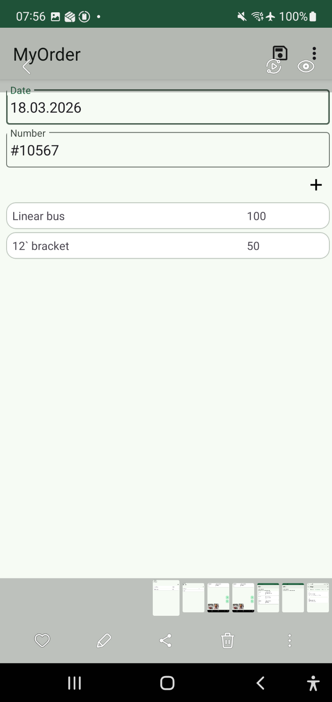
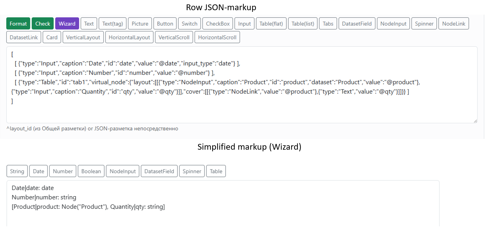

.. NodaLogic documentation master file, created by
sphinx-quickstart on Wed Nov 5 07:29:33 2025.
You can adapt this file completely to your liking, but it should at least
contain the root `toctree` directive.

Techniques for Simplifying Development
=======================================

While developing processes and interfaces using the built-in AI generator simplifies development, NodaLogic nevertheless has a number of approaches and patterns that can significantly simplify a solution and make it more readable and compact. With these approaches, even AI is not required.

Single-screen nodes/documents.
-----------------------------------

When a document/node/process has only one screen (which is quite common), there's no point in attaching the onShow/onShowWeb handler and creating a Python method for it that simply executes self.Show() and self.PlugIn() . You can simply specify the layout and PlugIn array on the Display tab in Init screen layout/PlugIn /InitScreenLayoutWeb /PlugIn /PlugInWeb. As with skins, fields without "web" specify the layout for both the mobile and web versions, but if you need to specify a specific layout for the web, fields ending in "web" take precedence.

Of course, if you need to initialize something on open, you'll still have to implement a method, but this approach still makes the solution more readable. These fields are combined with the Show/PlugIn methods and, of course, can be overridden at any time from the handler.

Standard Buttons, Migration
--------------------------------

The "Use standard commands" checkbox enables the standard "Save" and "Delete" buttons in node forms for both the mobile and web versions. For the web version, "Delete Selected" is also enabled in the list.

Autosave can be used for mobile.

On the Migration tab, you can enable another standard button—the "Register" command. For the mobile platform, this button uploads to the default server (defined in Configuration Servers). For the web version, this button is equivalent to the register command for the room alias defined in the class on the Migration tab (and the room itself (physical) is selected as a match for the alias in the Rooms section of the configuration (in the specific configuration branch).

You can also enable Register on Save, which does the same as this button, but be careful – saving, for example, can occur with any input, which is not the best option if the upload request is executed with each letter entered.

Auto-Generated Table Section
--------------------------------

:scale: 25%
:align: center

It is often necessary to organize a document row list form as a table section. Several approaches with Table and NodeChildren are available for this (options where rows are separate nodes provide flexibility and reliability, while options where rows are simply objects in an array in the root document) are available), but the simplest approach is described below. For automatic organization of the table section in a form To implement node operations, including actions such as adding/deleting rows, opening a form for editing, and the editing form itself, a "virtual node" must be used. The idea is to place a Table in the form and specify the virtual_node property—an object with a cover (the node's cover is how the rows will appear in the table section) and a layout—the node's shape (how the record editing form that opens for the user when they want to edit a row will look). This node isn't stored separately as a standalone node; it's stored as a row in an array, in a variable equal to the table's id. In other words, the virtual_node handles adding/editing rows, deleting rows, and packing data into a variable in _data without a single line of code. At the same time, access is available to all these elements and the table data. This is a regular node.
It works with both a regular list form and with the table=true option.
Here's an example of a table section, where the rows are Product (another node) and Quantity.

.. code-block:: JSON

{
"type": "Table",
"id": "tab1",
"virtual_node": {
"layout": [ [{"type": "NodeInput","caption": "Product","id": "product", "dataset": "Product", "value":"@product"},{ "type": "Input","caption": "Quantity","id": "qty","value": "@qty" } ] ],
"cover": [[{"type": "NodeLink", "value": "@product" },{ "type": "Text", "value": "@qty"}]]
}
}

During user interaction, this part automatically writes strings to the _data key ``tab1 :[{ "product":..,":"qty":…}]``

Simplified Markup/Wizard
--------------------------

:scale: 55%
:align: center

This option doesn't cover all the markup capabilities, but only the basic scenario – markup in "rows" (without containers) and the use of basic types and fields of nodes and other datasets.

However, for a wide range of tasks, this markup is sufficient, and it can always be modified manually. This isn't part of the platform, but rather a part of N-Maker that simply converts JSON data.

A label can be transformed into a more human-readable one, and vice versa.

The input markup (init screen) and display markup (cover) each have their own rules and sets of available fields.

Fields are specified in the form <Caption>|<id>: <type> , for example Name|name: string . You don't need to remember this – they're just helper buttons. You can specify them separated by commas, which will create multiple elements in a "row."

Tables are also available, and you can have multiple of them – the system will automatically place them in tabs.
